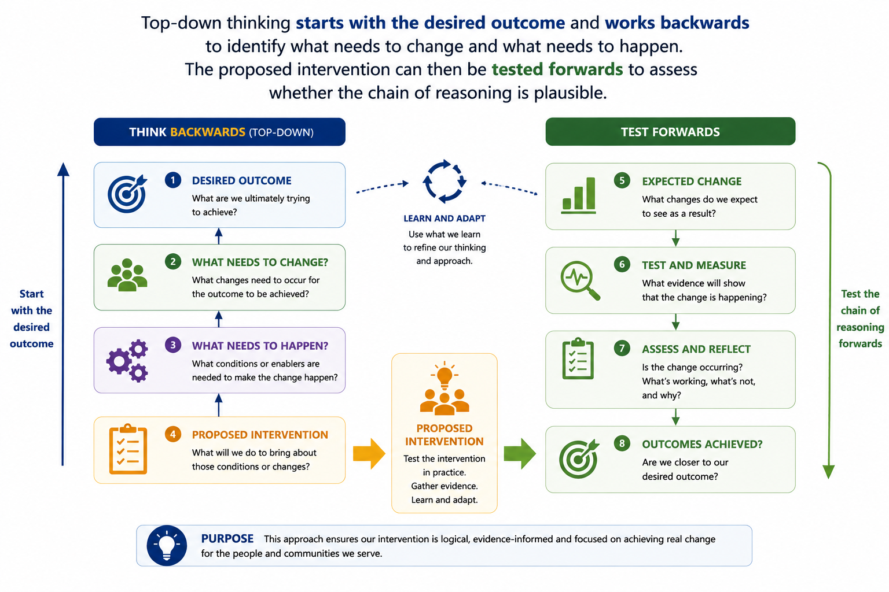
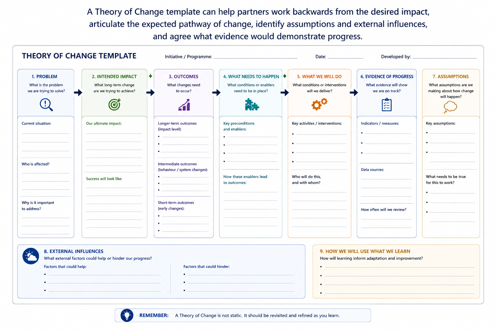
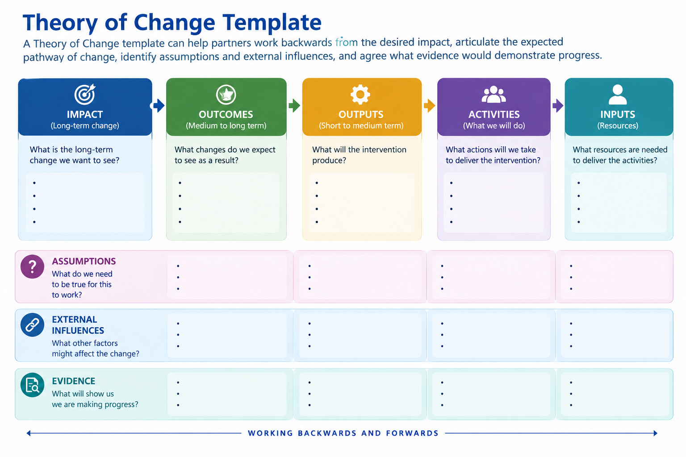
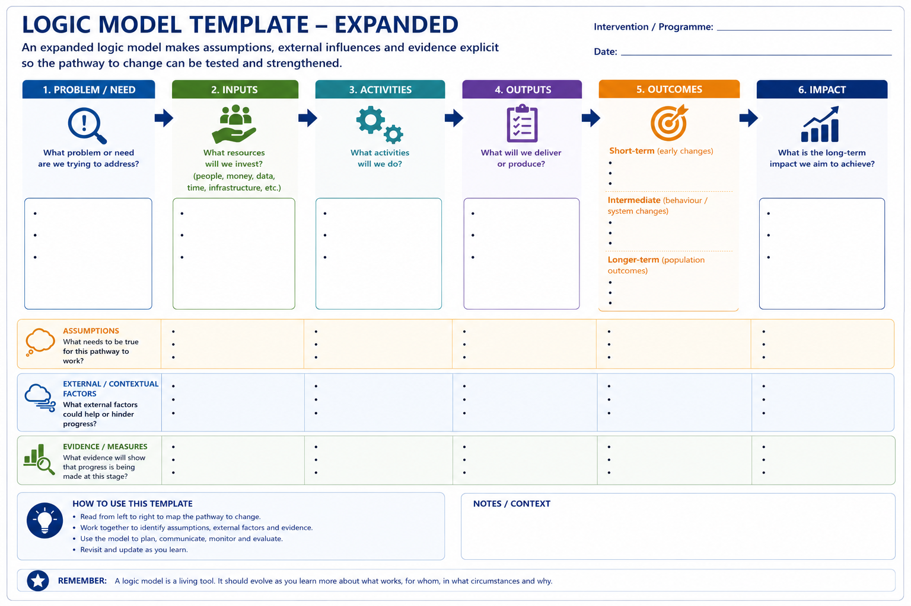
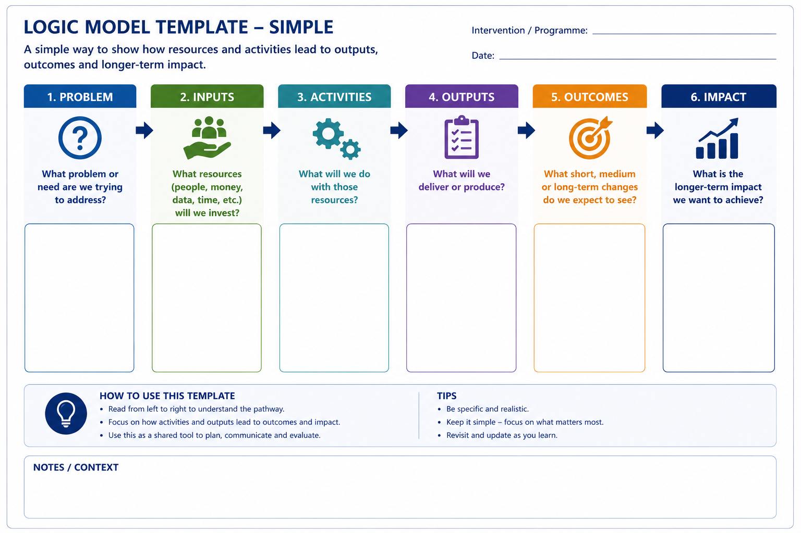

# Module 7 — Theory of Change and Logic Modules

# 1. Start With the Problem, Not the Solution

One of the most common risks in improvement work is beginning with an intervention before clearly defining the problem.

For example:

> **"We need a virtual ward."**

is a proposed solution.

It does not explain the problem the organisation is trying to solve.

The underlying problem might instead be:

> **"Some patients who could safely receive care at home are being admitted to hospital because appropriate monitoring and clinical support are not available in the community."**

That distinction matters.

Once the problem is clearly defined, different solutions may become possible.

A useful starting point is therefore to ask:

        - What problem are we trying to solve?
        - Who experiences the problem?
        - How large is it?
        - What evidence tells us it exists?
        - What are its underlying causes?
        - What happens if we do nothing?
        - What outcome are we ultimately trying to improve?

This prevents teams from designing an evaluation around a solution without first understanding whether it addresses the underlying problem.

::: {.callout-tip collapse="false"}
## Ask a Better Question

Instead of asking:

**"How will we measure our new service?"**

start by asking:

**"What problem are we trying to solve, what change are we trying to create, and why do we think this intervention will create it?"**

# 2. Think Backwards Before Moving Forwards

A useful way to approach service improvement is to start with the outcome we ultimately want to achieve and work backwards.

Rather than beginning with:

        "What intervention should we introduce?"
        
        begin with:
        
        "What outcome are we trying to achieve?"
        
        Then ask:
        
        "What would need to change for that outcome to happen?"
        
        and then:
        
        "What would need to happen to create those changes?"
        
        Only then should we ask:
        
        "What intervention or activities could reasonably make that happen?"
        
        This can be thought of as designing backwards from the desired outcome.
        
        Once the proposed intervention has been identified, the reasoning can then be tested in the opposite direction.
        
        Ask:
        
        "If we undertake these activities, will they realistically create the changes we expect?"
        
        and:
        
        "If those changes occur, is it plausible that they will contribute to the outcome we ultimately want?"

This creates a useful discipline:

Design backwards. Test forwards.

**Top-down thinking** starts with the desired outcome and works backwards to identify what needs to change and what needs to happen. The proposed intervention can then be tested forwards to assess whether the chain of reasoning is plausible.

This process can help prevent organisations from beginning with a preferred solution and then trying to construct a rationale around it afterwards.

It also encourages teams to examine the evidence and assumptions supporting each link in the chain.

At every stage, ask:

        - What evidence supports this relationship?
        - What assumptions are we making?
        - What would need to be true for this to happen?
        - What could prevent it from happening?
        - Are there alternative explanations or approaches?

This is the foundation of Theory of Change thinking.

# 3. What Is a Theory of Change?

A Theory of Change describes how and why an intervention is expected to lead to a desired outcome.

::: {.callout-note collapse="false"}
## A Simple Theory of Change

A Theory of Change connects the problem we are trying to solve with the outcomes we ultimately want to achieve:

**Problem** → **Intended Change** → **What Needs to Happen** → **What We Will Do** → **Expected Change** → **Outcomes**

Each stage encourages us to make the reasoning behind an intervention explicit:

| Stage | Key Question |
|---|---|
| **Problem** | What problem are we trying to solve? |
| **Intended change** | What needs to be different? |
| **What needs to happen** | What conditions or changes are needed to make that possible? |
| **What we will do** | What intervention or activities will we undertake? |
| **Expected change** | What do we expect to happen as a result? |
| **Outcomes** | What are we ultimately trying to achieve? |

The purpose is to make the **chain of reasoning** visible: not simply what we plan to do, but **how and why we believe those actions will lead to the outcomes we want**.
:::

Importantly, a Theory of Change also considers the assumptions and context surrounding those relationships.

For example, suppose an NHS system wants to reduce emergency admissions among people living with chronic kidney disease.

The proposed intervention might involve providing greater specialist renal support within primary care.

The underlying reasoning might be:

**If patients with chronic kidney disease are identified earlier and primary care teams receive greater specialist support, then patients should receive more proactive monitoring and treatment. This should reduce avoidable deterioration, which may ultimately reduce acute kidney injury and emergency hospital admissions.**

That statement contains a chain of assumptions.

For it to work:

         - appropriate patients must be identified
         - primary care teams must have capacity to respond
         - specialist capacity must be available
         - recommended interventions must be implemented
         - patients must engage with monitoring and treatment
         - earlier management must genuinely reduce deterioration.

Making these assumptions visible allows them to be questioned and tested.

A Theory of Change Is More Than a Diagram

The finished diagram can be useful, but the real value often lies in the thinking and discussion required to create it.

A Theory of Change should encourage partners to explore:

         - what success actually means
         - how change is expected to happen
         - what assumptions underpin the proposed approach
         - what evidence supports those assumptions
         - what contextual factors may influence success
         - what information will be needed to determine whether change occurred.

A simple template can help structure that conversation.

There is no single correct format for a Theory of Change. The level of detail required will depend on the intervention, the decision being made and the people involved.

The following templates illustrate two possible approaches: a more detailed facilitated template for developing the Theory of Change collaboratively, and a simpler one-page structure for summarising and communicating it.

### A Detailed Theory of Change Template

This version provides a more structured approach for working through the **problem, intended impact, outcomes, intervention, assumptions, external influences and evidence** with partners.

### A Simplified Theory of Change Template

This version provides a simpler one-page structure for summarising the pathway from **resources and activities through to outcomes and impact**, while making assumptions, external influences and evidence explicit.

Both approaches can help partners work backwards from the desired impact, articulate the expected pathway of change, identify assumptions and external influences, and agree what evidence would demonstrate progress.

Importantly, these templates are not intended to be completed by one person in isolation.

Their greatest value comes from **bringing different perspectives into the same conversation**.

::: {.callout-tip collapse="false"}
## The Template Is a Tool, Not the Goal

There is no need to follow a particular Theory of Change template simply because it is widely used.

Choose or adapt a format that helps the people involved answer the important questions:

**What are we trying to achieve? Why do we believe this intervention will achieve it? What needs to happen along the way? What assumptions are we making? And what evidence will tell us whether our reasoning was right?**
:::
Its greatest value comes from bringing different perspectives into the same conversation.

# 4. What Is a Logic Model?

A Logic Model provides a structured representation of how an intervention is expected to work.

::: {.callout-note collapse="false"}
## A Simple Logic Model Structure

A common Logic Model structure connects the resources invested in an intervention with the change it is ultimately intended to achieve:

**Problem** → **Inputs** → **Activities** → **Outputs** → **Outcomes** → **Impact**

Each stage answers a different question:

| Stage | Key Question |
|---|---|
| **Problem** | What problem are we trying to solve? |
| **Inputs** | What resources do we need? |
| **Activities** | What will we actually do? |
| **Outputs** | What will the intervention directly produce? |
| **Outcomes** | What should change as a result? |
| **Impact** | What is the wider, longer-term change we hope to achieve? |

The important distinction is that **activities and outputs describe what we do**, while **outcomes and impact describe the change we hope to create**.
:::

Problem

What are we trying to improve?

For example:

High levels of avoidable deterioration among people with chronic kidney disease.

Inputs

What resources are required?

Examples might include:

       - specialist renal clinicians
       - primary care staff time
       - data and analytical support
       - digital infrastructure
       - programme funding
       - training and education.
        
Activities

What will we actually do?

For example:

     - identify patients at higher risk
     - undertake proactive reviews
     - optimise medication and care plans
     - provide specialist advice to primary care
     - support patient self-management.
 
Outputs

What will the intervention directly produce?

Examples include:

    - number of patients identified
    - number of reviews completed
    - number of medication changes
    - number of specialist consultations
    - number of staff trained.

Outputs are important, but they should not be confused with outcomes.

Completing 1,000 reviews tells us that activity occurred.

It does not tell us whether patients became healthier.

Outcomes

What should change as a result?

Short-term outcomes might include:

    - improved monitoring
    - better medication management
    - improved patient knowledge
    - earlier identification of deterioration.

Intermediate outcomes might include:

    - fewer episodes of acute deterioration
    - fewer emergency attendances
    - fewer unplanned admissions
    - improved quality of life.
    - Impact

What is the wider, longer-term goal?

For example:

    - improved health and quality of life
    - reduced inequalities
    - fewer avoidable emergency admissions
    - more sustainable use of healthcare resources
    - better outcomes for patients and populations.

A worked Logic Model showing how the problem, resources, activities, outputs, outcomes and longer-term impact can be connected, while recognising the assumptions and contextual factors that influence whether the expected pathway occurs.

### Choosing a Logic Model

As with Theory of Change, there is no single correct format for a Logic Model. The appropriate level of detail will depend on the intervention and how the model will be used.

The following templates illustrate two possible approaches: a simple Logic Model for describing the core pathway from resources and activities to outcomes, and an expanded version that also makes assumptions, contextual influences and evidence requirements explicit.

#### A Simple Logic Model

This version provides a straightforward way of showing how the resources invested and activities undertaken are expected to lead to outputs, outcomes and longer-term impact.

#### An Expanded Logic Model

For more complex interventions, the basic Logic Model can be extended to consider the assumptions being made, external or contextual influences, and the evidence that will be used to assess whether each stage occurred as expected.

Both approaches serve the same fundamental purpose: to make the relationship between **what we invest, what we do, what we deliver and what we hope to change** visible.

The appropriate model is the one that helps the people involved understand the intervention and make better decisions—not necessarily the one with the most detail.

# 5. From Activity to Outcomes

One of the most valuable features of a Logic Model is that it separates activity from impact.

Healthcare organisations often measure what is easiest to count.

For example:

    - number of appointments
    - number of referrals
    - number of assessments
    - number of patients enrolled
    - number of staff trained.

These are useful measures of implementation.

But they do not necessarily demonstrate that the intervention has achieved its purpose.

A programme might deliver every planned activity and still fail to improve outcomes.

Conversely, poor implementation may mean that an effective intervention never had a realistic opportunity to demonstrate an effect.

A Logic Model therefore helps distinguish between two different questions:

        Did we deliver what we intended?
        
        and:
        
        Did delivering it lead to the outcomes we expected?

Both questions matter.

## 6. Theory of Change and Logic Models: What Is the Difference?

The terms **Theory of Change** and **Logic Model** are sometimes used interchangeably, and different organisations may define or apply them slightly differently.

For practical purposes, it is useful to think of them as **complementary rather than competing approaches**.

They both help make explicit the relationship between an intervention and the outcomes it is intended to achieve, but they tend to place emphasis on different aspects of that relationship.

::: {.callout-note collapse="false"}
## Theory of Change vs Logic Model

| **Theory of Change** | **Logic Model** |
|---|---|
| Explains **how and why** change is expected to happen | Provides a **structured representation** of how an intervention is expected to work |
| Explores **assumptions and causal reasoning** | Links **inputs, activities, outputs, outcomes and impact** |
| Considers **mechanisms, context and external influences** | Shows the main stages through which the intervention is expected to operate |
| Helps explain **why particular activities should lead to change** | Helps show **what should happen at each stage** |
| Often broader and more explanatory | Often more structured and operational |
:::

### A Simple Way to Think About the Difference

A **Theory of Change** asks:

> **Why and under what circumstances should this intervention create change?**

It encourages us to explore the reasoning behind the intervention:

- Why should these activities lead to the expected outcomes?
- What needs to happen along the way?
- What assumptions are we making?
- What contextual factors might help or hinder change?
- What evidence supports the links in our reasoning?

A **Logic Model** asks:

> **How do the resources we invest and the activities we undertake connect to the outputs, outcomes and impact we hope to achieve?**

It provides a more structured way of representing the intervention:

**Problem → Inputs → Activities → Outputs → Outcomes → Impact**

### They Can Be Used Together

In practice, there is no need to choose one approach and exclude the other.

A **Theory of Change** can help partners explore, discuss and challenge the reasoning behind an intervention.

A **Logic Model** can then provide a concise structure for showing how the different components of the intervention connect.

For example, a Theory of Change might help a team explore **why** providing specialist renal support in primary care could reduce avoidable hospital admissions.

The discussion might identify that:

- patients need to be identified earlier
- deterioration needs to be recognised sooner
- primary care teams need access to specialist advice
- appropriate treatment changes need to occur
- patients need to engage with monitoring and treatment
- sufficient primary and community care capacity needs to exist.

A Logic Model could then organise that thinking into the resources required, activities to be undertaken, outputs expected and short-, intermediate- and longer-term outcomes to be monitored.

::: {.callout-tip collapse="false"}
## Think of Them as Different Views of the Same Intervention

        **Theory of Change**
        
        **Why should this work?**
        
        ↓
        
        Explores the **reasoning, assumptions, mechanisms and context**
        
        **Logic Model**
        
        **What should happen?**
        
        ↓
        
        Structures the **inputs, activities, outputs, outcomes and impact**

Used together, they can provide a stronger foundation for designing, implementing and evaluating an intervention.
:::

### Do Not Get Too Concerned About the Terminology

Neither approach needs to become a complicated academic exercise.

Different organisations, evaluation frameworks and practitioners may use slightly different terminology or structures.

The purpose is not to produce the "correct" diagram.

The purpose is to make the reasoning behind an intervention:

**Visible → Discussable → Challengeable → Testable**

That means being able to explain:

- the problem we are trying to solve
- the outcomes we are trying to achieve
- why we believe the proposed intervention will create those outcomes
- what needs to happen along the way
- what assumptions we are making
- what external factors could influence success
- what evidence we will need to determine whether the expected changes occurred.

::: {.callout-important collapse="false"}
## The Important Point

Do not become too concerned about whether something should technically be called a **Theory of Change** or a **Logic Model**.

What matters is whether the process helps everyone involved develop a **shared understanding of the problem, the intended change, how and why that change is expected to happen, the assumptions being made and the evidence needed to assess whether it did**.

If the framework improves that conversation, it is doing its job.
:::

# 7. Build It Together

Theory of Change and Logic Models are particularly valuable when developed collaboratively.

##Different partners see different parts of the system.##

        A commissioner may understand the intended strategic outcomes.
        
        A provider may understand how the intervention will operate in practice.
        
        Clinicians may understand how patient care needs to change.
        
        Patients and carers may identify barriers or outcomes that professionals have overlooked.
        
        Analysts may identify what can realistically be measured.
        
        Evaluation specialists may challenge assumptions about attribution and causality.
        
        Health economists may identify important resource consequences, costs and opportunity costs.
        
        Bringing these perspectives together can reveal disagreements that might otherwise remain hidden until implementation.

For example, commissioners may believe that introducing additional community capacity will reduce hospital admissions.

        Providers may believe the main benefit will instead be shorter hospital stays.
        
        Patients may value continuity of care more highly than either measure.
        
        These are not simply differences in measurement.
        
        They may reveal fundamentally different assumptions about what the intervention is intended to achieve.

Developing the Theory of Change together creates an opportunity to surface and resolve these differences before implementation.

::: {.callout-tip collapse="false"}

The Conversation May Be More Valuable Than the Diagram

The greatest value of a Theory of Change or Logic Model may not be the finished graphic.

It may be the conversation required to create it.

The process forces partners to agree what problem they are solving, what they expect to change and what success should look like.
:::

# 8. Assumptions Matter

Every intervention contains assumptions.

Some are obvious.

Others remain hidden.

Suppose a programme introduces proactive case finding for people at high risk of hospital admission.

The programme may assume that:

   - risk identification is sufficiently accurate
   - clinicians have capacity to respond
   - effective interventions are available
   - patients accept the support offered
   - community services have sufficient capacity
   - earlier intervention can prevent deterioration.

If any of these assumptions fail, the programme may not achieve its intended outcome.

That does not necessarily mean the original idea was wrong.

It may mean:

the intervention was not implemented as expected
the context changed
an underlying assumption was incorrect
another part of the pathway prevented the expected change.

Identifying assumptions before implementation therefore helps organisations understand what they need to learn as well as what they need to measure.

# 9. Context Matters Too

Healthcare interventions do not operate in isolation.

Outcomes may also be influenced by:

    - workforce availability
    - seasonal pressures
    - demographic change
    - deprivation
    - patient behaviour
    - organisational culture
    - national policy
    - other improvement programmes
    - changes elsewhere in the healthcare system.

This becomes particularly important when several interventions are happening simultaneously.

If emergency admissions fall after several services have changed, it may be difficult to attribute the improvement to any single intervention.

Understanding the original Theory of Change can help evaluators investigate how different interventions may have contributed to the observed outcome.

This idea is explored further later in the series in Evaluating Change in Complex Healthcare Systems.

# 10. Use the Model to Decide What Information You Need

One of the most practical benefits of developing a Theory of Change or Logic Model early is that it helps identify measurement requirements before implementation begins.

For each part of the model, ask:

What would we need to observe to know whether this happened?

::: {.callout-example collapse="false"}
## Example: Linking the Logic Model to Evaluation Questions

A Theory of Change or Logic Model can help identify the questions that should be answered at each stage of an intervention.

| Stage | Example Question |
|---|---|
| **Activity** | Did proactive reviews actually take place? |
| **Output** | How many eligible patients received a review? |
| **Short-term outcome** | Did monitoring or treatment improve? |
| **Intermediate outcome** | Did deterioration reduce? |
| **Longer-term outcome** | Did emergency admissions fall? |
| **Equity** | Did outcomes improve across different population groups? |
| **Experience** | How did patients and staff experience the change? |

The important point is that evaluation should not focus only on the final outcome. It should also examine whether the intervention was delivered as intended, whether the expected intermediate changes occurred, and whether benefits were experienced equitably.
:::

This often reveals data gaps while there is still time to address them.

It may also show that some outcomes cannot be understood through routinely collected quantitative data alone.

Patient experience, staff experience and implementation barriers may require qualitative evidence.

Economic consequences may require additional information about costs and resource use.

Equity questions may require outcomes to be examined across different population groups.

The model therefore provides a bridge between:

designing an intervention

and

designing its evaluation.

::: {.callout-tip collapse="false"}

Work Backwards From the Decision Too

Do not collect information simply because it is available.

Ask:

"What decision will this information help us make?"

This keeps measurement focused on information that is useful for decision-making rather than generating additional reporting for its own sake.
:::

# 11. Do Not Wait Until the End

A common mistake is to develop the evaluation after an intervention has already started.

By then:

baseline data may not have been collected
appropriate comparison groups may be difficult to identify
important implementation measures may be missing
patient experience may not have been captured
assumptions may never have been documented
important cost information may not have been collected.

Developing the Theory of Change and Logic Model early helps avoid this.

It allows evaluation thinking to become part of intervention design rather than something added afterwards.

The following modules build on this foundation.

Evaluating Interventions & Schemes: Thinking About Evidence considers how we should think about causality, attribution, counterfactuals and evidence.

Evaluating Interventions in Practice: Methods introduces practical approaches for determining whether observed changes are likely to represent genuine intervention effects.

Later in the series, Evaluating Change in Complex Healthcare Systems explores what happens when several interventions, organisations and contextual factors interact and simple attribution becomes much more difficult.

# 12. Useful Resources

This module provides an introduction rather than a comprehensive guide to Theory of Change or Logic Models.

The following resources provide more detailed guidance, examples and practical tools.

## NHS Evaluation Toolkit

The NHS Evaluation Toolkit provides practical guidance for planning evaluation in health and care.

Its Identify & Understand stage encourages teams to understand the need being addressed, how an intervention is expected to achieve change, the assumptions behind it and the context in which it operates.

It also signposts resources relating to Theory of Change and Logic Models.

https://nhsevaluationtoolkit.net/

## Health Innovation West of England — Theory of Change

Health Innovation West of England provides evidence and evaluation resources designed to support healthcare improvement, including practical guidance relating to Theory of Change.

This is particularly relevant for people working in health and care who want to use Theory of Change as part of service improvement and evaluation.

https://www.healthinnowest.net/our-work/west-of-england-academy/evidence-and-evaluation/theory-of-change/

## NIHR ARC West — Theory of Change

NIHR Applied Research Collaboration West provides learning resources on Theory of Change for people involved in health and care research, innovation, implementation and evaluation.

The resources explore Theory of Change, how it can be developed and how it can support evaluation in practice.

https://arc-w.nihr.ac.uk/training-and-capacity-building/arc-west-courses/theory-of-change/

## The Strategy Unit — Using Logic Models in Evaluation

The Strategy Unit has produced NHS-focused guidance and practical resources on using Logic Models in evaluation.

These resources are useful for understanding how Logic Models can support stakeholder engagement, programme design and evaluation planning.

https://www.strategyunitwm.nhs.uk/publications/tools-templates-using-logic-models-evaluation

## GOV.UK — Creating a Logic Model for an Intervention

The Office for Health Improvement and Disparities provides detailed guidance on creating Logic Models for health and wellbeing interventions.

The guidance considers:

    - inputs and resources
    - implementation
    - mechanisms of impact
    - outcomes
    - context
    - relationships between different parts of an intervention.

https://www.gov.uk/guidance/evaluation-in-health-and-wellbeing-creating-a-logic-model

## Top-Down Thinking

Top-down thinking provides a useful complementary way of approaching Theory of Change.

Begin with the outcome you ultimately want to achieve and work backwards to identify what needs to change and what needs to happen.

The proposed intervention can then be tested forwards to examine whether the expected chain of change is plausible.

https://prezi.com/sqysrut0_r7s/top-down-thinking-explained/

::: {.callout-note collapse="false"}

## A Starting Point, Not a Prescription

There is no single correct format for a Theory of Change or Logic Model.

Different organisations and evaluation traditions use different terminology and structures.

The important question is not whether your diagram follows a particular template.

It is whether the process helps partners develop a credible, evidence-informed and testable explanation of how the proposed intervention is expected to create change.
:::

# Key Takeaways

Theory of Change and Logic Models help organisations move from:

"We think this is a good idea."

to:

"This is the problem we are trying to solve, this is the outcome we want to achieve, this is how we believe our intervention will create change, these are the assumptions we are making, and this is the evidence we will need to determine whether it worked."

Remember:

                start with the problem, not the preferred solution
                start with the outcome and work backwards
                then test the logic forwards
                distinguish activities and outputs from outcomes
                make assumptions explicit
                consider context and external influences
                involve different partners and perspectives
                identify measurement requirements before implementation
                use the model to inform evaluation rather than creating it retrospectively
                revisit it as the intervention and evidence evolve
                keep it simple enough to remain useful.

::: {.callout-important collapse="false"}

# The Bigger Picture

Theory of Change and Logic Models are not simply evaluation tools.

They are decision-making tools.

They help commissioners, providers, clinicians, analysts, patients and other partners develop a shared understanding of what they are trying to achieve, why they believe a particular approach will work, what assumptions they are making and what evidence they will need to make better decisions.

That is why they are an important part of Healthcare Decision Intelligence.
:::
