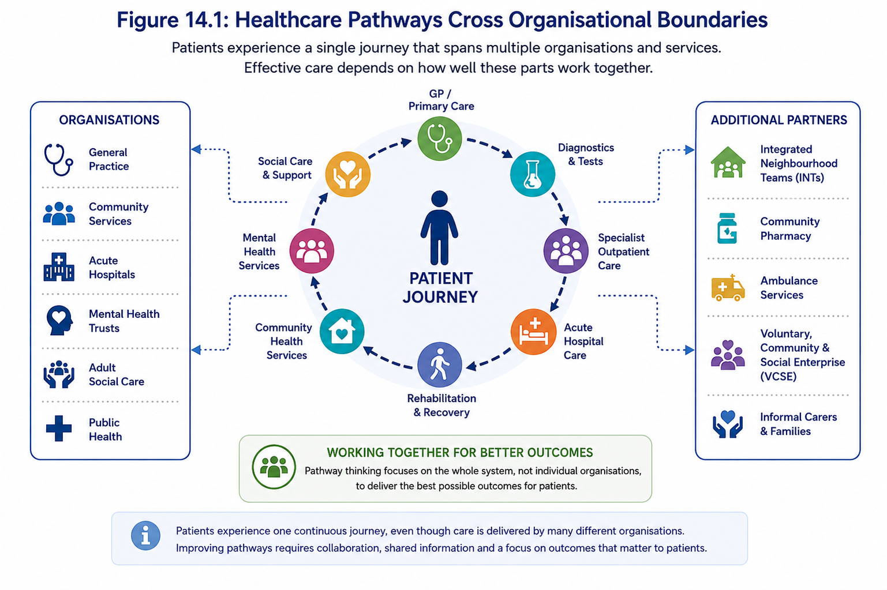
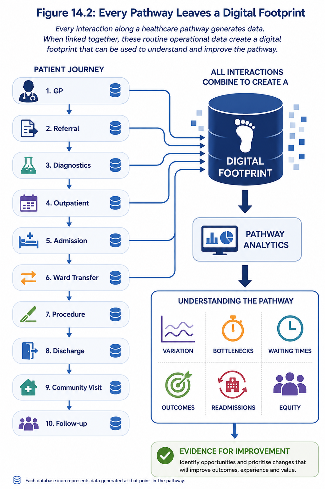
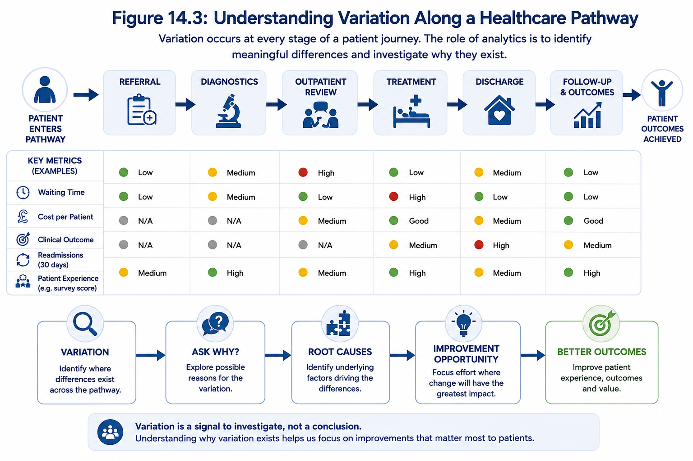
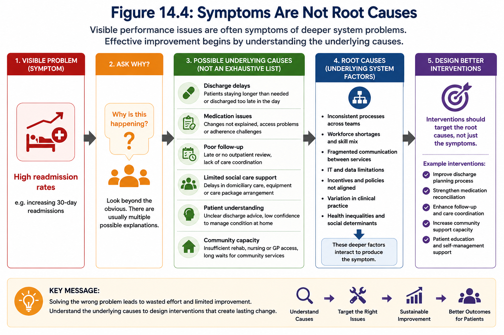
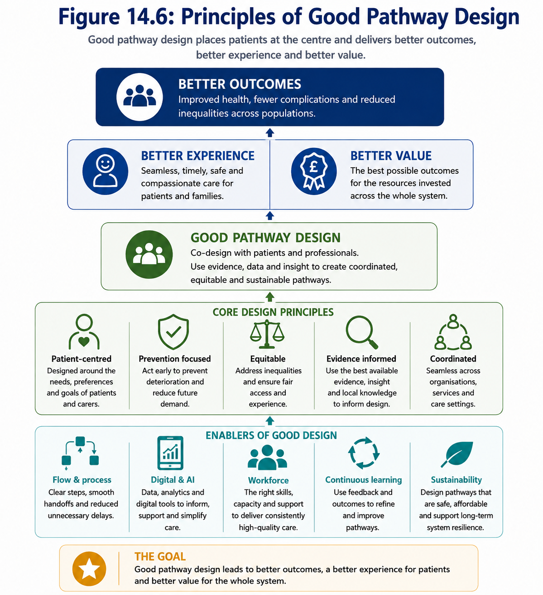
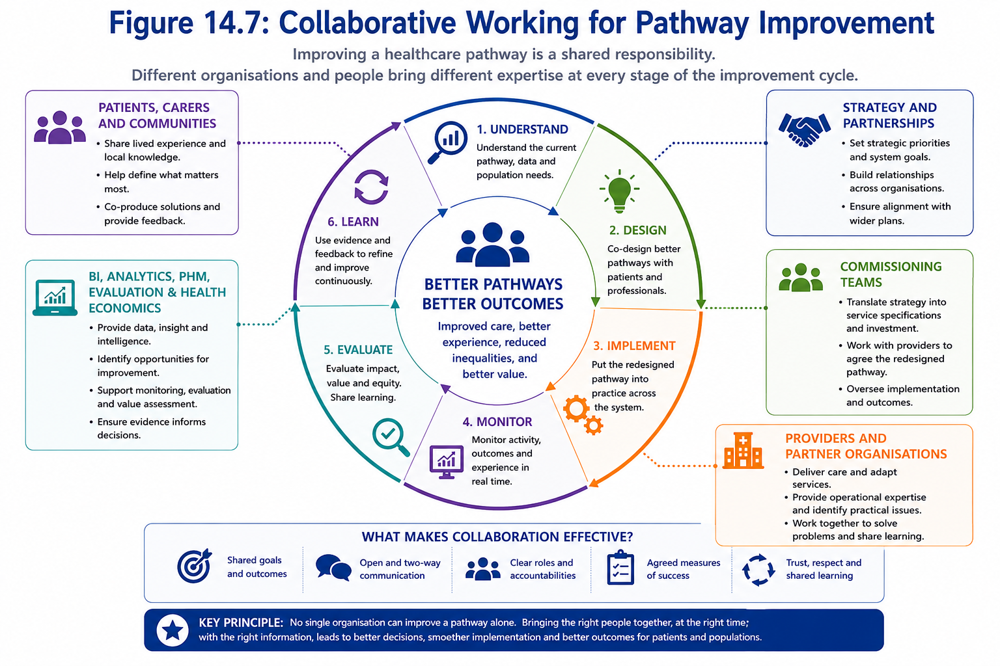
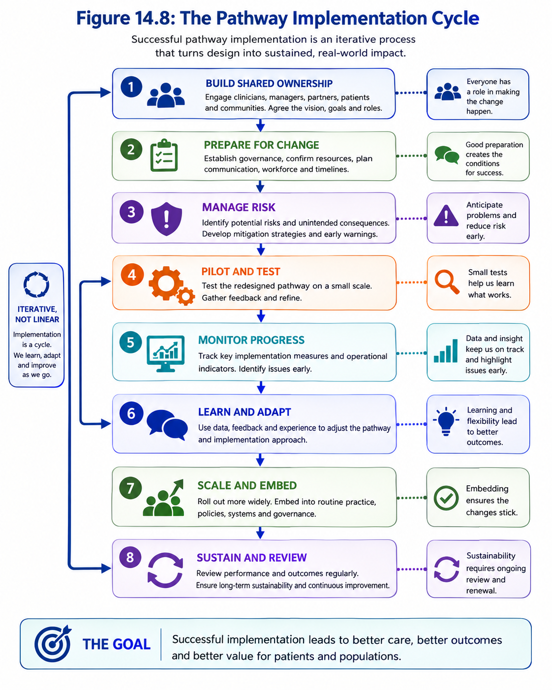
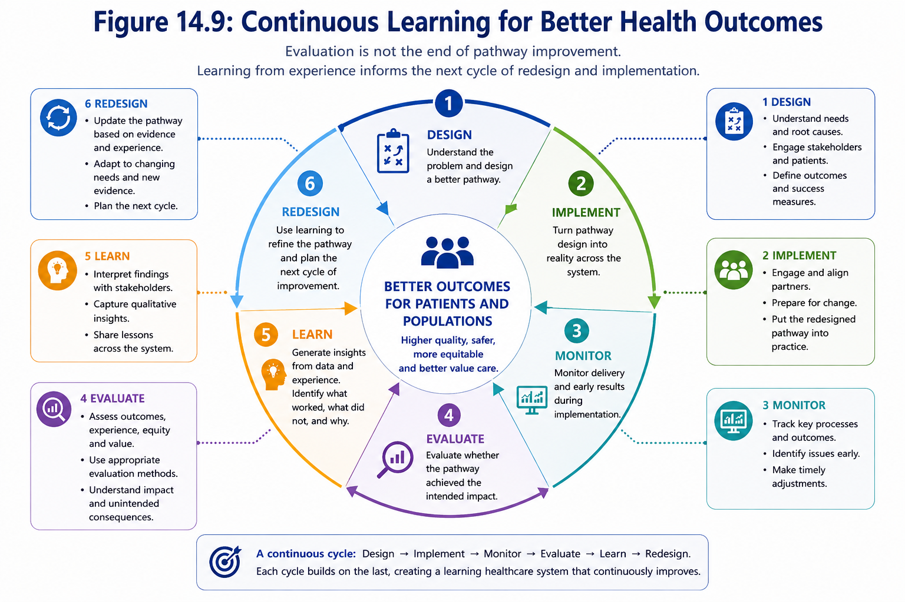
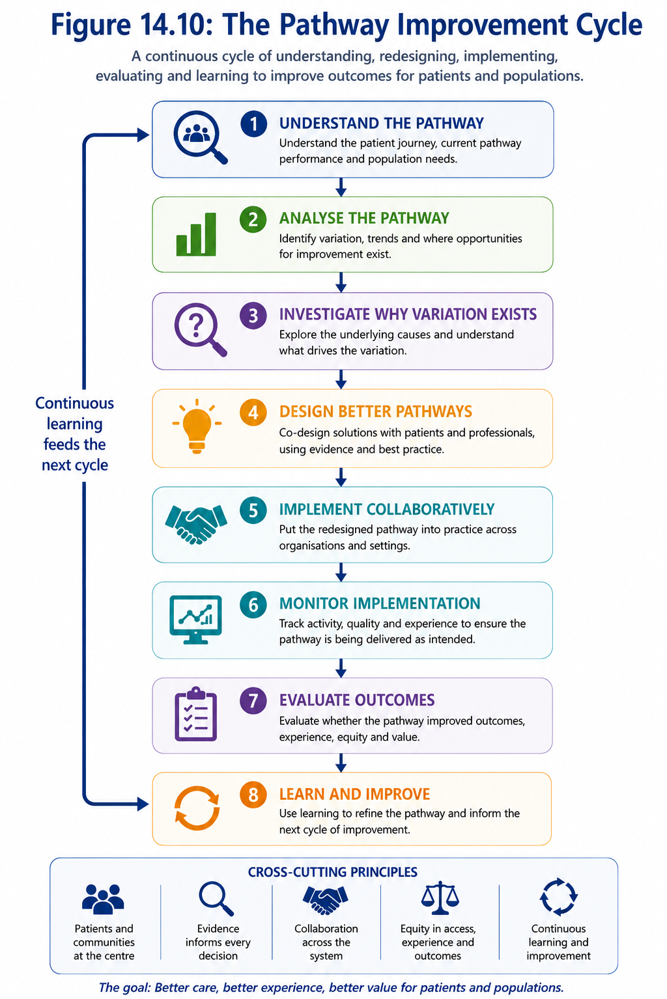

# Module 14: Designing Better Healthcare Pathways

## Learning Objectives

By the end of this module you should be able to:

- Explain why healthcare pathways matter more than organisational boundaries.
- Understand how routine healthcare data can be used to map and analyse patient pathways.
- Identify variation, bottlenecks and opportunities for improvement along a pathway.
- Use evidence to inform the design of new or redesigned healthcare pathways.
- Consider equity, prevention and population need when designing interventions.
- Recognise the importance of integrated working across organisations, including primary care, community services, hospitals, local authorities and the voluntary sector.
- Understand how logic models and theories of change support pathway redesign.
- Appreciate why evaluation should be planned before implementation.
- Ask better questions when reviewing proposals for service redesign.

<!-- Learning Journey & Module Connections figure to be added after Modules 13–20 are finalised -->

Builds on:
- Module X
- Module Y

Prepares for:
- Module Z
- Module A

## Why This Matters

Every day, thousands of patients move between general practice, community services, hospitals, mental health services, social care and voluntary organisations. From the patient's perspective this is a single journey, yet it is often delivered by multiple organisations, professional groups and information systems.

Healthcare pathways are therefore much more than clinical flow diagrams. They describe how people access care, how services interact, where delays occur, how resources are used and ultimately whether patients receive timely, effective and equitable care.

Well-designed pathways can improve patient outcomes, reduce unwarranted variation, prevent avoidable admissions, improve patient experience and make better use of limited healthcare resources. Poorly designed pathways can lead to duplication, fragmented care, unnecessary delays, increased costs and poorer outcomes.

Data plays a central role throughout this process. Every referral, assessment, admission, transfer, discharge and follow-up appointment leaves a digital footprint. When combined with clinical evidence, patient and staff experience, and an understanding of how healthcare systems operate, these data provide powerful insights into where improvements can be made.

However, redesigning a pathway is about much more than analysing data. Effective pathway design requires an understanding of the underlying causes of problems, the needs of different populations, the evidence supporting potential interventions, the practical realities of implementation and how success will be evaluated.

Throughout this module we will follow the journey from understanding the current pathway through to designing an improved future pathway. Along the way, we will explore how data, evidence and systems thinking can support better decision-making and help healthcare organisations design services that improve outcomes, reduce inequalities and deliver greater value for patients and populations.

## 1. Understanding Healthcare Pathways

When most people think about healthcare services, they naturally think in terms of organisations—general practice, community services, hospitals, mental health trusts or social care. Patients, however, rarely experience healthcare in this way.

From the patient's perspective, healthcare is a continuous journey. A person may visit their GP, undergo diagnostic tests at an acute hospital, receive treatment from a specialist team, require support from community services, access rehabilitation and later receive ongoing care from primary care. Increasingly, that journey may also involve social care, community pharmacy, Integrated Neighbourhood Teams (INTs) and voluntary, community and social enterprise (VCSE) organisations.

This connected journey is known as a **healthcare pathway**.

::: {.callout-note collapse="false"}
## Definition

A **healthcare pathway** is the coordinated sequence of care that a patient experiences as they move through health and care services to prevent, diagnose, treat, manage or recover from a health condition.

Healthcare pathways often span multiple organisations, professional groups and information systems, making collaboration essential for delivering high-quality, patient-centred care.

*Figure 14.1: Patients experience a single healthcare journey that spans multiple organisations and services. Every interaction creates data that can be used to understand and improve the pathway.*
:::

Rather than focusing on the performance of individual organisations, pathway thinking focuses on how well the whole system works together to achieve the best possible outcomes for patients.

Ultimately, the purpose of a healthcare pathway is not simply to deliver activity, but to improve patient outcomes, patient experience and value while making the best use of limited healthcare resources.

::: {.callout-important collapse="false"}
## Thinking in Pathways

Patients do not experience organisations—they experience pathways.

Improving one organisation does not necessarily improve the patient's overall journey if delays, duplication or poor communication occur elsewhere in the pathway.
:::

### Why Pathways Matter

Many of today's healthcare challenges cannot be solved by individual organisations working in isolation.

For example:

- Reducing emergency admissions requires collaboration between primary care, community services, ambulance services and hospitals.
- Supporting frail older people often involves Integrated Neighbourhood Teams, therapists, community nurses, social care and voluntary organisations.
- Successful hospital discharge depends upon effective coordination between acute providers, community services, local authorities and carers.
- Preventing progression of chronic kidney disease requires coordinated working between general practice, nephrology services, pathology, community teams and patients themselves.

Looking at only one part of the pathway can lead organisations to optimise their own performance while unintentionally creating problems elsewhere.

For example, discharging patients more quickly may improve hospital performance, but if community capacity is insufficient it may simply shift demand into other parts of the health and care system or increase the risk of readmission.

Organisations often optimise their own performance measures, such as reducing waiting times, increasing throughput or achieving performance targets. While these improvements are valuable, they do not necessarily improve the performance of the pathway as a whole. In some cases, improvements in one part of the system may unintentionally create delays, increase demand or shift pressures elsewhere.

::: {.callout-example collapse="false"}
## Example 14.1: Improving Hospital Discharge

An acute hospital may successfully reduce the average length of stay by discharging patients sooner. However, if community rehabilitation services, social care or voluntary sector support are not available when needed, patients may experience delays in recovery, require readmission or place additional pressure on other parts of the health and care system.

This illustrates why pathway improvement should focus on the **whole patient journey** rather than the performance of individual organisations.
:::

### Pathways Are Increasingly Integrated

The NHS is increasingly moving away from organisationally focused care towards integrated models that coordinate services around the needs of patients and populations.

Many pathways now span multiple organisations, including:

- General Practice
- Community Health Services
- Acute Hospitals
- Mental Health Services
- Community Pharmacy
- Ambulance Services
- Adult Social Care
- Public Health
- Integrated Neighbourhood Teams (INTs)
- Voluntary, Community and Social Enterprise (VCSE) organisations

Designing effective pathways therefore requires organisations to work collaboratively, share information appropriately and focus on outcomes that matter to patients rather than individual organisational targets.

This is an example of **systems thinking**. Rather than viewing services in isolation, systems thinking considers how different parts of the health and care system interact and influence one another. Throughout this module we will adopt a systems perspective to understand where meaningful improvements can be made and how changes in one part of the pathway may affect others.

### The Role of Data

Every interaction within a healthcare pathway creates information.

Appointments, referrals, diagnostic tests, admissions, transfers, procedures, discharge summaries and follow-up appointments all contribute to a patient's digital record.

When linked together, these records allow analysts, clinicians and service leaders to understand how patients move through the system, where delays occur, which patients experience poorer outcomes and where opportunities for improvement may exist.

Understanding a pathway is the first step towards improving it. Before deciding what should change, we first need to understand how patients currently move through the system, where variation exists, where delays occur and which parts of the pathway have the greatest influence on outcomes.

The next section explores how routine healthcare data can be be used to understand the current pathway, identify opportunities for improvement and support evidence-informed redesign.

::: {.callout-tip collapse="false"}
## Decision-Maker Questions

When reviewing a healthcare pathway, ask yourself:

- Are we viewing the pathway from the patient's perspective or from the perspective of individual organisations?
- Which organisations contribute to this pathway?
- Where are patients most likely to experience delays, duplication or fragmented care?
- Which parts of the pathway create the greatest value for patients?
- Are we measuring organisational performance or the performance of the whole pathway?
:::

::: {.callout-tip collapse="false"}
## Decision-Maker Questions

When considering a healthcare pathway, ask yourself:

- Are we thinking about the whole patient journey or only our part of the system?
- Which organisations, teams and professionals contribute to this pathway?
- Where do patients experience transitions between services?
- Could improving one part of the pathway unintentionally create problems elsewhere?
- Are we measuring success from the perspective of the organisation or the patient?
- Who else needs to be involved if we are to improve outcomes across the entire pathway?
:::

## 2. Understanding the Current Pathway

Before redesigning a healthcare pathway, it is essential to understand how the current pathway operates. Too often, services introduce new initiatives based on assumptions about where problems exist rather than evidence.

Effective pathway redesign begins by asking:

- How do patients currently move through the pathway?
- Where do delays occur?
- Which patients experience poorer outcomes?
- Where is demand greatest?
- Which parts of the pathway appear to have the greatest influence on patient outcomes?

Answering these questions requires more than reviewing organisational performance measures. It requires understanding the pathway as a connected system.

### Map the Pathway as It Actually Operates

The first step is to describe how the pathway currently works—not simply how policies, service specifications or process maps say it should work.

A current-state pathway map should show:

- how patients enter the pathway
- the main stages and decision points
- which organisations and professionals are involved
- where information is transferred
- where patients wait, move between services or leave the pathway
- where responsibility for care changes
- how patients with different needs may follow different routes.

This should be developed collaboratively with the people who deliver and experience the pathway. Analysts can describe patterns within the data, but clinicians, operational teams, patients and carers often reveal informal workarounds, communication failures and practical barriers that are not visible within routine records.

::: {.callout-example collapse="false"}
## Example 14.2: The Designed Pathway versus the Real Pathway

A service specification may state that patients referred with suspected heart failure should receive diagnostic testing within two weeks before being reviewed by a specialist.

However, discussions with clinicians and administrators reveal that diagnostic capacity is limited, some referrals are redirected, additional investigations are requested before appointments can be booked, and patients may attend emergency departments while waiting.

The documented pathway appears straightforward. The real pathway experienced by patients is considerably more complex.

Understanding this difference is often the first step towards meaningful pathway improvement.
:::

### Every Pathway Leaves a Digital Footprint

Every interaction between a patient and the health and care system generates data.

Referrals, appointments, diagnostic tests, admissions, ward transfers, procedures, prescriptions, community visits and discharge summaries all leave a digital footprint. Individually, these events provide information about a single episode of care. Together, they tell the story of how patients move through the healthcare system.

When linked appropriately, these routine operational data can reveal:

- common routes through a pathway
- where patients wait longest
- where patients drop out of the pathway
- where demand is concentrated
- which patient groups experience different outcomes
- how resource use varies across the pathway.

Healthcare organisations already collect much of the information needed to understand pathways. The challenge is often not collecting more data, but connecting existing data to build a complete picture of the patient journey.

*Figure 14.2: Every interaction along a healthcare pathway generates data. When linked together, these routine operational data create a digital footprint that can be used to understand how patients move through the health and care system.*

::: {.callout-important collapse="false"}
## The Digital Footprint Is Not the Whole Pathway

Routine data provide an important view of how patients interact with services, but they rarely tell the complete story.

They may not capture:

- unmet need among people who never access services
- why patients miss appointments or leave the pathway
- informal care provided by families and carers
- communication failures between organisations
- patient and staff experience
- activity recorded in systems that cannot yet be linked
- differences between the care recorded and the care actually delivered.

Understanding a pathway therefore requires routine data to be combined with clinical knowledge, operational insight and the experiences of patients, carers and staff.
:::

### Define the Population and the Pathway Boundaries

Before analysing a pathway, it is important to define clearly:

- which patients are included
- how entry into the pathway is identified
- where the pathway begins and ends
- the period over which patients will be followed
- which organisations and services are included
- which outcomes will be examined
- whether patients can enter the pathway more than once.

These decisions determine what the analysis can meaningfully conclude.

For example, an analysis of chronic kidney disease may begin with diagnosis in general practice, referral to nephrology, an emergency attendance for acute kidney injury or admission to hospital. Each starting point represents a different patient population and answers a different evaluation question.

### Looking Beyond Activity

It is tempting to focus on activity measures such as the number of referrals, appointments, admissions or procedures. While these metrics are important for understanding demand and workload, they rarely explain **why** variation exists or whether patients are receiving the right care at the right time.

A pathway should therefore be examined from multiple perspectives, including:

- patient outcomes
- patient experience
- equity
- operational performance
- resource use
- variation
- clinical quality.

Considering these together provides a much richer understanding than any single performance measure.

::: {.callout-example collapse="false"}
## Example 14.3: Looking Beyond Activity

Two hospitals admit a similar number of patients with chronic kidney disease each month.

Looking only at admission counts might suggest that both pathways perform similarly.

However, further analysis shows that one hospital has substantially higher readmission rates, longer waiting times for specialist review and poorer outcomes for patients living in more deprived communities.

Although activity is similar, the pathway is performing very differently.

This illustrates why pathway analysis should focus on the whole patient journey rather than isolated activity measures.
:::

The next step is to understand how variation occurs within the pathway, distinguish normal variation from meaningful differences, and identify where the greatest opportunities for improvement exist.

::: {.callout-tip collapse="false"}
## Decision-Maker Questions

Before redesigning a pathway, ask yourself:

- Do we understand how the pathway currently operates in practice?
- Have we spoken to the people delivering and experiencing the pathway?
- Is the patient population clearly defined?
- Can patient activity be linked across organisations?
- What parts of the pathway are invisible within the available data?
- Are we considering outcomes, experience, equity and resource use as well as activity?
- Could apparent differences reflect data quality, coding or access rather than genuine differences in care?
:::

## 3. Understanding Variation Along the Pathway

Once the current pathway has been mapped and the available data assembled, the next step is to understand how performance varies along the patient journey.

Every healthcare pathway exhibits variation. Patients differ, clinical needs differ, services operate in different environments and healthcare itself is inherently complex. Variation is therefore both inevitable and expected.

The challenge for decision-makers is not to eliminate variation, but to distinguish between variation that is expected and variation that suggests opportunities for improvement.

::: {.callout-important collapse="false"}
## Key Principle

Variation is a signal to investigate, not a conclusion.

The purpose of pathway analytics is not to remove all variation, but to understand why it exists and determine whether it represents an opportunity to improve patient care.

:::

*Figure 14.3: Variation occurs throughout every stage of a healthcare pathway. Pathway analytics identifies where meaningful differences exist and helps investigate their underlying causes.*

Variation may occur at many different stages of a pathway, including differences in:

- referral patterns
- waiting times
- diagnostic testing
- treatment decisions
- length of stay
- discharge processes
- readmission rates
- patient outcomes
- patient experience
- resource utilisation.

Importantly, variation observed at one point in the pathway is often caused by events occurring much earlier. A bottleneck in discharge, for example, may reflect delays in community services, workforce constraints or problems in discharge planning rather than inefficiencies on the ward itself.

Understanding pathways therefore requires systems thinking. Rather than examining each stage in isolation, we seek to understand how different parts of the pathway interact and influence one another.

### Warranted and Unwarranted Variation

Not all variation should be eliminated.

Some variation is entirely appropriate because patients have different clinical needs, preferences and levels of complexity. This is known as **warranted variation**.

Examples include:

- patients with multiple long-term conditions requiring longer admissions
- specialist centres managing more complex referrals
- treatment decisions based on informed patient choice.

Other variation cannot be explained by patient need or sound clinical judgement. Instead, it may arise from differences in clinical practice, access to services, operational processes, workforce availability or organisational performance. This is known as **unwarranted variation**.

One of the principal aims of pathway analytics is to distinguish between these two forms of variation so that improvement efforts focus where they are most likely to benefit patients.

### Looking Beyond the Numbers

Variation should rarely be interpreted in isolation.

For example, one hospital may have longer waiting times than another. At first glance this appears undesirable.

However, further investigation may show that the hospital treats patients with greater clinical complexity, provides more specialist services or receives referrals from a wider geographical area.

Conversely, apparently good performance may hide important problems such as patients being diverted elsewhere, inappropriate referrals or inequalities in access.

Numbers tell us **where** variation exists.

Understanding the pathway helps explain **why** it exists.

### Learning from Positive Variation

Variation should not always be viewed as a problem.

Sometimes variation identifies organisations or teams achieving consistently better outcomes, shorter waiting times or improved patient experience despite working with similar populations.

Rather than asking *"Why are others performing worse?"*, an equally valuable question is:

> **"What can we learn from those achieving the best results?"**

Pathway analytics therefore supports both identifying problems and spreading good practice across healthcare systems.

### Variation from Different Perspectives

Variation can be examined from several perspectives, each providing a different understanding of pathway performance.

- **Clinical variation** – differences in diagnosis, treatment or outcomes.
- **Operational variation** – waiting times, flow, bottlenecks and delays.
- **Financial variation** – differences in cost, resource use and value.
- **Patient experience variation** – satisfaction, access and continuity of care.
- **Equity variation** – differences between demographic or socioeconomic groups.
- **Workforce variation** – staffing levels, skills and service capacity.

Considering multiple perspectives provides a more complete understanding of how a pathway is functioning than relying on a single performance measure.

### Asking Why

Once variation has been identified, the next question should always be:

**Why?**

Possible explanations include:

- differences in population need
- case mix and clinical complexity
- deprivation
- service configuration
- workforce availability
- operational processes
- coding practices
- data quality
- random variation
- genuine differences in performance.

Only after exploring these explanations should conclusions be drawn.

::: {.callout-example collapse="false"}
## Example 14.4: Longer Is Not Always Worse

Hospital A has a median waiting time of six weeks for a specialist clinic.

Hospital B has a median waiting time of four weeks.

An immediate conclusion might be that Hospital B performs better.

However, further investigation shows that Hospital A accepts more complex referrals requiring additional diagnostic investigations before clinic review, while Hospital B redirects many of these patients to tertiary centres.

The observed variation reflects differences in case mix and pathway design rather than poorer operational performance.

Without understanding the reasons behind the variation, decision-makers could reach the wrong conclusion.
:::

### Distinguishing Signal from Noise

Not every observed difference is meaningful.

Small numbers, random fluctuation and natural variation can all create apparent differences that disappear over time.

Understanding pathway variation therefore draws together many of the concepts introduced earlier in this book, including:

- **Module 4:** Understanding Variation
- **Module 5:** Standardisation and Fair Comparisons
- **Module 10:** Reading Dashboards Critically
- **Module 11:** Evaluating Healthcare Improvement

Together, these provide the analytical foundation for distinguishing genuine opportunities for improvement from normal operational variation.

The objective is not simply to identify where pathways differ, but to identify where meaningful improvements can be made.

::: {.callout-tip collapse="false"}
## Decision-Maker Questions

When reviewing variation along a pathway, ask yourself:

- Which differences are expected and which are unexpected?
- Is this variation warranted or unwarranted?
- Have we adjusted for differences in population or case mix?
- Could the observed variation reflect data quality or coding differences?
- Is this variation consistent over time or simply random fluctuation?
- Are we learning from areas performing particularly well?
- Which areas of variation have the greatest impact on patients?
- What additional evidence do we need before drawing conclusions?
:::

Understanding **where** variation exists is only the beginning.

The next challenge is determining **why** it occurs.

Effective pathway redesign depends on identifying the underlying causes of variation rather than simply reacting to its symptoms.

## 4. Investigating Why Variation Exists

Identifying variation is only the first step.

The more important question is:

> **Why does this variation exist?**

Healthcare organisations often respond quickly to visible problems such as increasing waiting times, rising admissions or higher readmission rates. However, these are usually symptoms of deeper issues rather than the underlying problem itself.

Improvement efforts are most successful when they address the causes of variation rather than its consequences.

::: {.callout-important collapse="false"}
## Key Principle

Treat the symptom.

Understand the cause.

Improve the system.
:::

### Symptoms Are Not Root Causes

A symptom is something that can be observed.

A root cause is the underlying factor that produces the symptom.

For example, increasing emergency admissions may initially appear to be the problem. However, the true causes may include delayed diagnosis, poor access to community services, medication adherence, workforce shortages, socioeconomic factors or inadequate discharge planning.

Without understanding these underlying causes, organisations risk implementing solutions that address the visible problem while leaving the real issue unchanged.

*Figure 14.4: Visible performance issues are often symptoms of deeper system problems. Effective improvement begins by understanding the underlying causes.*

### Looking Across the Whole System

Healthcare pathways operate as interconnected systems.

A delay observed in one part of the pathway is frequently caused by factors occurring elsewhere.

For example, delayed discharge may be influenced by:

- community rehabilitation capacity
- availability of domiciliary care
- housing support
- pharmacy delays
- transport arrangements
- family or carer availability
- discharge planning processes.

Similarly, high emergency admissions may reflect earlier challenges in prevention, diagnosis or ongoing management within primary or community care.

Understanding these interactions helps avoid local optimisation that simply moves problems elsewhere within the system.

Figure 14.5 illustrates how effective pathway improvement moves beyond treating visible symptoms. Rather than reacting to problems where they appear, organisations investigate upstream causes, understand the wider system, identify the greatest opportunities for improvement, design interventions that address the underlying issues and finally evaluate whether those changes have achieved their intended impact.

*Figure 14.5: Effective pathway improvement follows a structured process: investigate the problem, understand the wider system, identify high-leverage opportunities, design interventions that address underlying causes and evaluate whether meaningful improvement has been achieved. Problems observed later in the pathway often originate much earlier.*

Although shown as a sequence, improvement is rarely a linear process. Findings from implementation and evaluation frequently lead organisations to revisit their understanding of the pathway, refine their assumptions and redesign interventions in an ongoing cycle of learning and improvement.

### Avoid Jumping to Conclusions

Understanding why variation exists requires careful investigation rather than quick assumptions.

Just because two events occur together does not mean that one caused the other.

For example, an increase in emergency admissions following the introduction of a new community service does not necessarily mean the service caused the increase. Seasonal illness, demographic change, workforce pressures or changes in coding may all contribute to the observed trend.

Likewise, an apparent improvement following the introduction of a new pathway does not automatically demonstrate that the intervention was successful. Other changes occurring at the same time—such as staffing changes, seasonal pressures or wider system initiatives—may also have influenced the outcome.

Before designing an intervention, decision-makers should be confident that they understand the factors genuinely driving the observed variation.

This is why causal thinking and robust evaluation are essential components of pathway improvement.

### Rarely a Single Cause

Healthcare problems are seldom explained by a single factor.

Increasing waiting times, for example, may result from rising demand, workforce shortages, inefficient booking processes, delayed diagnostics, seasonal pressures and limited community capacity occurring simultaneously.

Similarly, high readmission rates may reflect a combination of patient complexity, discharge processes, medication management, social care availability and health inequalities.

These factors often interact with one another. Addressing only one may improve performance slightly, while leaving the wider problem largely unchanged.

Effective pathway improvement therefore considers how multiple interacting factors combine to influence performance, rather than searching for one simple explanation.

### Asking Better Questions

Good investigations begin with good questions.

Rather than asking:

- Why are admissions increasing?
- Why are waiting times longer?
- Why are readmissions higher?

Decision-makers should ask:

- What has changed?
- Where in the pathway did this begin?
- Who is most affected?
- Is this happening consistently or only within particular groups?
- Could multiple factors be contributing simultaneously?
- What evidence supports each possible explanation?
- What evidence would help us distinguish between competing explanations?

Better questions lead to better investigations and ultimately better interventions.

### Using Multiple Sources of Evidence

Routine data can identify **where** variation exists, but it rarely explains **why** it exists.

Understanding healthcare pathways requires combining multiple sources of evidence.

Quantitative evidence may include:

- routine activity data
- waiting times
- outcomes
- readmissions
- financial information
- workforce data.

Qualitative evidence may include:

- patient feedback and surveys
- interviews with patients, carers and staff
- complaints and compliments
- pathway observations and process walkthroughs
- multidisciplinary team discussions
- clinical audit
- incident reviews
- operational knowledge from frontline teams.

Each provides a different perspective on how the pathway operates.

By bringing these sources together, organisations develop a richer and more complete understanding than either quantitative or qualitative evidence could provide alone.

::: {.callout-important collapse="false"}
## Key Principle

Numbers often tell us **where** to investigate.

People often help us understand **why**.
:::

### Root Cause Analysis

Once sufficient evidence has been gathered, structured investigation techniques can help identify the underlying causes of variation.

Examples include:

- Five Whys
- Fishbone (Ishikawa) Diagrams
- Process Mapping
- Failure Mode and Effects Analysis (FMEA)
- Driver Diagrams.

The specific technique matters less than the mindset behind it.

All encourage organisations to move beyond surface-level observations and develop a deeper understanding of how complex healthcare systems behave.

Rather than asking *"What happened?"*, they encourage teams to ask *"Why did it happen?"* and *"What within the system allowed it to happen?"*

::: {.callout-example collapse="false"}
## Example 14.5: Reducing Readmissions

An organisation identifies increasing 30-day readmissions for patients with heart failure.

An initial response might be to increase outpatient appointments following discharge.

However, further investigation shows that many patients struggle to obtain prescribed medication before leaving hospital, receive limited education about recognising early deterioration and experience delays accessing community heart failure services.

Although readmissions are the visible problem, they are not the underlying cause.

The improvement effort therefore focuses on pharmacy processes, discharge education and community follow-up rather than simply increasing clinic capacity.

By addressing the underlying causes rather than the symptom, the intervention is more likely to achieve sustainable improvement.
:::

### Developing a Theory of Change

Once the likely causes of variation have been identified, the next step is deciding how those causes should be addressed.

Every improvement initiative is based on an assumption about **how change will occur**. This is often referred to as a **Theory of Change**—a clear explanation of how a proposed intervention is expected to lead to improved outcomes.

A Theory of Change links together:

- the problem being addressed
- the underlying causes
- the proposed intervention
- the expected changes in behaviour or processes
- the anticipated short-, medium- and long-term outcomes.

Making these assumptions explicit helps organisations test whether their understanding of the problem is correct before investing significant time and resources in implementation.

If the underlying assumptions about the causes of variation are incorrect, even a well-designed intervention may fail to achieve its intended impact.

Conversely, a simple intervention that targets the true root causes may produce substantial improvements across multiple parts of the pathway.

::: {.callout-important collapse="false"}
## Key Principle

Every intervention is based on an implicit explanation of **why the problem exists**.

Making that explanation explicit through a Theory of Change allows assumptions to be challenged before implementation begins.
:::

### Anticipating Unintended Consequences

Healthcare systems are highly interconnected.

Changes made to one part of a pathway frequently influence other parts of the system, sometimes in unexpected ways.

For example:

- improving access to diagnostics may increase demand on outpatient clinics
- reducing length of stay may increase pressure on community services
- introducing new referral pathways may increase workload within primary care
- expanding virtual consultations may unintentionally disadvantage patients with limited digital access.

These unintended consequences do not necessarily mean that an intervention is unsuccessful. Rather, they highlight the importance of considering the whole system when planning change.

Effective pathway redesign therefore anticipates how different parts of the healthcare system may respond and plans accordingly.

::: {.callout-example collapse="false"}
## Example 14.6: Reducing Length of Stay

A hospital successfully reduces average length of stay by introducing earlier discharge planning.

Although inpatient capacity improves, community nursing teams experience a substantial increase in workload because more patients require support shortly after discharge.

The intervention improves one part of the pathway while creating additional pressure elsewhere.

Considering these wider system impacts during planning allows organisations to develop complementary solutions, such as increasing community capacity alongside changes to hospital discharge processes.
:::

### Finding High-Leverage Improvement Opportunities

Not every identified problem deserves the same level of attention.

Some interventions require considerable investment but produce only modest improvements.

Others address a relatively small underlying cause that influences multiple parts of the pathway.

These are often referred to as **high-leverage improvement opportunities**—areas where relatively small changes can produce disproportionately large benefits across the healthcare system.

Examples might include:

- improving referral criteria to reduce unnecessary investigations
- strengthening medication reconciliation at discharge
- improving communication between organisations
- increasing patient self-management support
- simplifying administrative processes that delay patient flow.

Focusing on high-leverage opportunities enables organisations to maximise the impact of limited financial, workforce and operational resources.

### Prioritising Improvement Opportunities

In practice, organisations rarely have sufficient resources to address every identified issue.

Improvement priorities should therefore consider both the **potential impact** of an intervention and the **feasibility** of implementing it.

Factors influencing prioritisation may include:

- expected improvement in patient outcomes
- reduction in health inequalities
- patient and staff experience
- financial implications
- workforce requirements
- implementation complexity
- organisational readiness
- strategic priorities.

Considering these factors helps ensure that pathway redesign focuses on interventions that are both meaningful and achievable.

::: {.callout-important collapse="false"}
## Key Principle

The best improvement opportunity is not always the largest problem.

It is often the intervention that addresses an important underlying cause while remaining practical, affordable and sustainable to implement.
:::

### From Investigation to Improvement

By this stage, organisations should have developed a much richer understanding of the pathway than was possible from routine performance reports alone.

They should understand:

- where variation exists
- which variation is meaningful
- the likely causes of that variation
- how different parts of the pathway interact
- which underlying causes offer the greatest opportunity for improvement
- the assumptions underpinning potential interventions.

Only once this understanding has been established should pathway redesign begin.

Skipping this stage risks implementing solutions that are based on assumptions rather than evidence.

::: {.callout-tip collapse="false"}
## Decision-Maker Questions

Before redesigning a pathway, ask yourself:

- Are we addressing symptoms or the underlying causes?
- Have we considered the pathway as a whole rather than focusing on one organisation or service?
- What evidence supports our explanation of the problem?
- Have we combined quantitative data with qualitative evidence?
- Could multiple interacting factors be contributing?
- Have we clearly articulated our Theory of Change?
- What unintended consequences might arise elsewhere in the system?
- Which improvement opportunities are likely to deliver the greatest overall benefit?
- Do we have sufficient evidence to justify redesigning the pathway?

:::

Investigating why variation exists marks the transition from understanding a problem to improving it.

Once the underlying causes have been identified and the wider system understood, organisations can begin redesigning pathways that address root causes rather than symptoms.

The next section explores how evidence, systems thinking and patient-centred design can be combined to create pathways that consistently deliver better outcomes while making the best use of available resources.

## 5. Designing Better Pathways

Understanding why a healthcare pathway performs as it does provides the foundation for improvement.

The next challenge is deciding **how the pathway should be redesigned** to consistently deliver better outcomes for patients while making the best use of available resources.

Pathway redesign is about far more than improving the performance of individual services. It involves rethinking how patients move through the healthcare system, identifying opportunities to remove unnecessary barriers, strengthening coordination across services and organisations, and ensuring that every stage of the pathway contributes to better outcomes and patient experience.

There is rarely a single *perfect* pathway. Every redesign involves balancing competing priorities such as timely access, quality, patient experience, workforce capacity, financial sustainability and equity. Good pathway design therefore requires evidence, collaboration and careful judgement rather than simply applying a standard solution.

Ultimately, the goal is to create pathways that are safer, simpler, more equitable and more responsive to the needs of the populations they serve.

::: {.callout-important collapse="false"}
## Key Principle

Design pathways around **patients rather than organisations**.

Patients experience one continuous journey through the healthcare system, even when their care spans multiple organisations, professional groups and services.
:::

### Principles of Good Pathway Design

Although every healthcare pathway is unique, successful redesign tends to share several common principles.

Figure 14.6 provides an overview of these principles. It places the patient journey at the centre of pathway design and distinguishes between the principles that should guide every stage of care and the wider system enablers that allow high-quality pathways to function effectively.

Good pathway design is not achieved by improving one stage of care in isolation. Instead, patient-centred care, prevention, equity, evidence and coordination should influence the entire journey, while reduced variation, efficient flow, data, digital technologies and AI, sustainable use of resources and continuous learning enable the pathway to perform consistently over time.

*Figure 14.6: Good pathway design places the complete patient journey at the centre. Shared principles guide every stage of care, while system-wide enablers support efficient, equitable, sustainable and continuously improving pathways.*

Taken together, these principles mean that well-designed pathways should:

- improve patient outcomes and experience
- support prevention and earlier intervention
- provide equitable access and outcomes
- use evidence and local insight to inform decisions
- coordinate care across organisational boundaries
- reduce unnecessary delays and duplication
- reduce unwarranted variation while maintaining appropriate flexibility
- use data, digital technologies and AI where they add genuine value
- make sustainable use of workforce and financial resources
- generate evidence for continuous learning and improvement.

These principles are closely interconnected. Improvements in one area often strengthen others, although pathway redesign inevitably involves balancing competing priorities and making informed trade-offs.

Rather than optimising individual parts of the system in isolation, effective pathway redesign seeks to improve the performance of the pathway as a whole.

Although every principle is important, the starting point is always the patient journey itself.

### Start with Patient Needs

Healthcare organisations often design services around professional roles, organisational structures or historical ways of working.

Patients, however, experience healthcare very differently.

From their perspective, there is no distinction between primary care, community services, hospitals or social care. They experience one continuous journey through the health and care system.

Good pathway design therefore begins by understanding what matters most to patients and carers.

Patients rarely judge healthcare by organisational performance indicators or waiting time targets alone. Instead, they ask questions such as:

- Was I able to access help when I needed it?
- Did professionals communicate with one another?
- Did I understand what was happening?
- Did I receive consistent information?
- Was my care coordinated?
- Did I know what would happen next?
- Was I supported after leaving hospital?

Understanding these experiences often reveals opportunities for improvement that are not immediately visible within routine performance data.

When pathways are designed around patient needs rather than organisational convenience, they frequently become both more effective and more efficient.

::: {.callout-example collapse="false"}
## Example 14.7: Seeing the Pathway Through the Patient's Eyes

A patient with chronic kidney disease may initially visit their GP before undergoing diagnostic blood tests, attending specialist outpatient clinics, experiencing an emergency admission following acute deterioration and later receiving ongoing support from community services.

To each organisation involved, these may appear as separate episodes of care.

To the patient, they represent one continuous healthcare journey.

Viewing the pathway from the patient's perspective often reveals duplicated assessments, inconsistent communication, unnecessary delays and gaps in continuity that would be difficult to identify by examining individual services in isolation.
:::

### Co-producing Better Pathways

No single group fully understands every aspect of a healthcare pathway.

Patients are experts in experiencing healthcare.

Frontline clinicians understand how care is delivered.

Managers understand operational constraints and service delivery.

Analysts understand the data, patterns of variation and opportunities for improvement.

Each perspective provides valuable insight, but none is sufficient on its own.

Successful pathway redesign therefore depends on bringing these different perspectives together.

Increasingly, healthcare organisations adopt a **co-production** approach, bringing together patients, carers, clinicians, managers and analysts to develop shared solutions.

Co-production helps ensure that redesigned pathways address problems that matter most to those delivering and receiving care, rather than focusing solely on organisational priorities.

For example, routine data may identify increasing outpatient non-attendance rates.

Patient discussions may reveal that appointment letters are difficult to understand, clinic locations are inaccessible by public transport or appointment times conflict with work and caring responsibilities.

Similarly, clinicians may identify unnecessary duplication of assessments between organisations that is not apparent from routinely collected data.

By combining quantitative evidence with operational knowledge and lived experience, organisations are more likely to develop improvements that are practical, sustainable and meaningful for patients.

::: {.callout-important collapse="false"}
## Key Principle

The best pathway designs combine **evidence with lived experience**.

Patients, carers, clinicians, operational teams and analysts each understand different parts of the pathway. Bringing these perspectives together leads to more effective, practical and sustainable redesign.
:::

### Design for Prevention, Not Just Treatment

Traditionally, many healthcare pathways have focused on responding once illness has developed or deteriorated.

Increasingly, healthcare systems are seeking to shift activity **upstream**, intervening earlier to prevent avoidable deterioration and reduce future demand.

Examples include:

- earlier diagnosis
- proactive identification of high-risk patients
- preventative interventions
- supporting self-management
- timely medication optimisation
- improving continuity of care
- strengthening community-based support.

Preventative pathways often require investment today, while many of the benefits are realised months or even years later.

However, preventing deterioration frequently improves patient outcomes while simultaneously reducing pressure on emergency departments, inpatient services and urgent care pathways.

As discussed in the previous section, many of the greatest opportunities for improvement lie upstream, long before patients require hospital treatment.

Preventative pathway redesign therefore requires organisations to think beyond immediate activity and consider how earlier intervention can improve outcomes across the whole healthcare system.

### Reduce Unwarranted Variation

Many preventative interventions also reduce unwarranted variation by ensuring patients receive timely, consistent care before their condition deteriorates.

Variation identified during pathway analysis should directly inform redesign.

The objective is **not** to make every patient's journey identical.

Healthcare should remain flexible enough to meet individual clinical needs, patient preferences and clinical judgement.

Instead, pathway redesign seeks to reduce **unwarranted variation**—variation that cannot be explained by legitimate differences in patient need.

Examples include:

- inconsistent referral criteria
- variation in access to diagnostics
- different discharge processes between organisations
- duplication of assessments
- inconsistent follow-up arrangements
- variation in clinical protocols where evidence supports standardisation.

Reducing unwarranted variation improves reliability while preserving appropriate flexibility.

Consistency should support personalised care rather than replace it.

### Design for Equity

Good pathway design should improve outcomes for the whole population, not only for those who already access services easily.

Barriers to care are not experienced equally.

Factors such as age, disability, ethnicity, language, deprivation, geography and digital exclusion may all influence whether patients are able to access services, navigate pathways or benefit from interventions.

Designing for equity means identifying these barriers early and considering how pathways can reduce rather than reinforce existing inequalities.

Examples include:

- improving access for underserved communities
- offering multiple methods of accessing services
- identifying groups with poorer outcomes
- adapting communication to different needs
- ensuring eligibility criteria do not unintentionally disadvantage particular populations.

Equity should therefore be considered throughout pathway design rather than evaluated only after implementation.

### Design for Value

Healthcare resources are finite.

Every investment in one pathway represents resources that cannot be invested elsewhere.

Good pathway design therefore seeks to maximise **value**, achieving the greatest possible improvement in health outcomes, patient experience and equity from the resources available.

Value extends beyond reducing costs.

An intervention that increases expenditure may still represent excellent value if it produces substantially better outcomes, prevents future illness or reduces demand elsewhere in the system.

Conversely, a pathway that is inexpensive but delivers poor outcomes or unnecessary activity may represent poor value.

Thinking about value encourages organisations to consider both the benefits and the opportunity costs of pathway redesign.

Health economics provides structured approaches for assessing these trade-offs and is explored in more detail in the next module.

### Data, Digital and AI as Enablers

Data, digital technologies and artificial intelligence are increasingly supporting pathway redesign.

However, technology should enable better pathways rather than become the primary objective.

Data help organisations understand variation, identify opportunities for improvement and monitor whether redesigned pathways achieve their intended outcomes.

Digital technologies can improve communication, coordination and patient access.

Artificial intelligence may assist with activities such as risk stratification, clinical decision support, demand forecasting and administrative automation.

These technologies can significantly enhance pathway redesign when implemented appropriately.

However, successful pathways continue to depend upon good clinical practice, effective leadership, collaboration and robust evaluation.

Technology is an enabler of improvement, not a substitute for thoughtful pathway design.

### Designing Sustainable Improvements

A pathway is only successful if improvements can be maintained over time.

Changes that rely upon temporary funding, individual enthusiasm or exceptional effort often prove difficult to sustain.

Sustainable pathway redesign considers:

- workforce capacity
- financial affordability
- operational feasibility
- organisational ownership
- training requirements
- digital infrastructure
- ongoing measurement and evaluation.

Designing sustainability into a pathway from the outset increases the likelihood that improvements will continue long after implementation.

### Designing for Continuous Learning

No pathway remains optimal forever.

Clinical evidence evolves.

Population needs change.

New technologies emerge.

Healthcare organisations therefore need pathways that can adapt over time.

Continuous learning involves routinely monitoring outcomes, reviewing patient experience, evaluating interventions and using evidence to refine pathways.

Improvement should be viewed as an ongoing cycle rather than a one-off redesign exercise.

### Shared Ownership

Successful pathways rarely belong to a single organisation.

Most healthcare pathways span primary care, community services, acute providers, mental health services, social care and voluntary sector organisations.

Effective redesign therefore depends upon shared ownership.

Shared objectives, agreed measures of success, transparent data and collaborative governance all help ensure that organisations work together towards improving the patient journey rather than optimising individual services.

### Pathway Design Checklist

Before implementing pathway changes, decision-makers should consider whether the proposed redesign:

- starts with patient needs and experience
- is supported by evidence
- addresses unwarranted variation
- strengthens prevention and earlier intervention
- improves equity
- delivers value for the resources invested
- uses data, digital technology and AI appropriately
- is operationally and financially sustainable
- includes plans for monitoring and evaluation
- has support from patients, clinicians and partner organisations.

::: {.callout-tip collapse="false"}
## Decision-Maker Questions

Before approving a redesigned pathway, ask yourself:

- Have we designed this pathway around the patient journey?
- What evidence suggests this redesign will improve outcomes?
- Which patients are most likely to benefit?
- Could any groups be disadvantaged?
- Does this redesign improve value as well as outcomes?
- How will we know whether it has worked?
- Is the pathway sustainable over the long term?
- Who is responsible for monitoring and continuously improving the pathway?
:::

### Transition to Implementation

Designing a better pathway is only the beginning.

The real challenge lies in successfully implementing change, measuring its impact and continuously refining the pathway as new evidence emerges.

The following section explores how healthcare organisations can evaluate whether redesigned pathways have delivered the improvements they were intended to achieve.

## 6. Turning Pathway Design into Reality

Designing a better pathway is an important achievement, but it is only the beginning.

Healthcare systems are inherently complex. Even well-designed pathways can fail if they are introduced without sufficient engagement, planning or support.

Successful implementation requires organisations to move beyond designing a better future state and focus on how that change will be introduced, adopted and sustained across the healthcare system.

Implementation is therefore not simply about delivering a project. It is about helping people, organisations and systems adopt new ways of working while maintaining safe, effective and equitable care throughout the transition.

### Why Good Pathway Designs Sometimes Fail

Many pathway redesigns appear technically sound but fail to achieve their intended benefits once introduced into routine practice.

Common reasons include:

- insufficient engagement with clinicians and operational teams
- unrealistic assumptions about workforce capacity
- lack of shared ownership across organisations
- poorly defined governance and responsibilities
- inadequate communication
- insufficient resources or digital infrastructure
- failure to monitor implementation
- resistance to change
- unintended consequences that were not anticipated.

In many cases, the pathway itself is not the problem.

Instead, difficulties arise because organisations underestimate the complexity of introducing change into busy healthcare systems involving multiple organisations, professions and competing priorities.

Successful implementation should therefore be considered during pathway design rather than after the redesign has been completed.

::: {.callout-important collapse="false"}
## Key Principle

A well-designed pathway does not improve healthcare on its own.

Improvement occurs only when the redesigned pathway is successfully adopted by the people and organisations responsible for delivering care.
:::

### Building Shared Ownership

Healthcare pathways rarely belong to a single organisation.

Patients often move between general practice, community services, acute hospitals, mental health services, community pharmacy, local authorities and voluntary organisations during a single episode of care.

Successful implementation therefore depends upon developing a shared understanding of:

- why change is needed
- the expected benefits
- individual roles and responsibilities
- measures of success
- governance arrangements
- how organisations will work together throughout implementation.

When organisations share ownership of a pathway, they are more likely to solve problems collaboratively, adapt to unexpected challenges and sustain improvements over time.

Shared ownership also helps avoid one of the most common causes of implementation failure—optimising one part of the pathway while unintentionally creating problems elsewhere.

### Leadership and Culture

Successful implementation depends as much on leadership and organisational culture as it does on technical pathway design.

Visible clinical leadership, executive sponsorship and engaged operational leaders help create confidence that change is both necessary and achievable.

However, leadership is not confined to senior managers.

Clinical leaders, operational managers, analysts and frontline staff all influence whether redesigned pathways become embedded into everyday practice.

Equally important is creating a culture where staff feel able to identify problems, suggest improvements and learn from implementation without fear of blame.

Healthcare improvement is rarely a linear process.

Unexpected challenges will arise, requiring organisations to adapt while remaining focused on the overall objectives of the pathway redesign.

Successful organisations therefore view implementation as a shared learning process rather than simply the delivery of a predefined project plan.

### Communicating the Change

People are more likely to support change when they understand why it is happening.

Communication should therefore begin early and continue throughout implementation.

Effective communication should explain:

- why the pathway is changing
- the evidence supporting the redesign
- how patients and populations are expected to benefit
- what will change
- what will remain unchanged
- how success will be measured
- how staff, patients and partner organisations can provide feedback.

Good communication builds trust, reduces uncertainty and encourages engagement across organisational boundaries.

Communication should also be two-way.

Listening to concerns from patients, clinicians, operational teams and partner organisations often identifies practical issues that can be addressed before they become barriers to successful implementation.

::: {.callout-tip collapse="false"}
## Decision-Maker Questions

Before implementation begins, ask yourself:

- Do all organisations understand why the pathway is changing?
- Have patients, clinicians and partner organisations helped shape the implementation?
- Is there genuine shared ownership of the redesign?
- Are leaders visibly supporting the change?
- Have we explained both the benefits and the practical implications of the redesign?
- Do staff know how they can raise concerns or contribute ideas during implementation?
:::

### Working Together Across the System

Successfully implementing a redesigned pathway is rarely the responsibility of a single team or organisation.

Modern healthcare pathways span multiple providers, commissioners, local authorities, community organisations and patients themselves. No single organisation has complete control over the entire pathway.

Successful implementation therefore depends upon collaboration, shared decision-making and continuous learning across the whole health and care system.

Different organisations contribute different expertise throughout the improvement journey.

- **Strategy and Partnerships** establish strategic priorities, build relationships between organisations and ensure pathway redesign supports wider system objectives.

- **Commissioning teams** work with providers to redesign pathways, develop service specifications, commission services and oversee implementation.

- **Providers and partner organisations** deliver care, contribute operational expertise and identify practical opportunities and challenges during implementation.

- **BI, Analytics, PHM, Evaluation and Health Economics** provide evidence throughout the improvement cycle, helping organisations understand current pathways, identify opportunities for improvement, monitor implementation and evaluate outcomes.

- **Patients, carers and communities** contribute lived experience, ensuring redesigned pathways focus on what matters most to the people receiving care.

Rather than working sequentially, these groups should work collaboratively throughout implementation, continually learning from one another and adapting as new evidence emerges.

*Figure 14.7: A mature, collaborative approach to improving healthcare pathways. Strategy, commissioning, providers, analytics and patients each contribute different expertise throughout the pathway improvement cycle.*

::: {.callout-important collapse="false"}
## Key Principle

Successful implementation is a shared responsibility.

Commissioners, providers, analysts, clinicians, patients and partner organisations each contribute different expertise. Sustainable improvement occurs when these perspectives are brought together rather than working in isolation.
:::

### Preparing for Implementation

Once a redesigned pathway has been agreed, organisations need to establish the practical foundations required for successful implementation.

Preparation typically includes:

- agreeing implementation objectives
- confirming pathway ownership
- establishing governance arrangements
- defining success measures
- agreeing implementation timescales
- confirming workforce and financial resources
- preparing digital systems and data collection
- developing communication and engagement plans
- identifying implementation risks.

Preparation should not be viewed as delaying implementation.

Time invested in planning often prevents avoidable problems later and increases the likelihood that improvements become embedded into routine practice.

### Turning Pathway Design into Reality

Successful implementation rarely follows a perfectly linear path.

Instead, organisations typically move through a continuous cycle of planning, testing, learning and refinement.

The implementation journey begins with a redesigned pathway but continues through shared ownership, preparation, risk management, piloting, monitoring, learning, scaling and ultimately evaluating impact.

Throughout this process, organisations frequently move backwards and forwards between stages as new information becomes available.

Continuous learning allows implementation teams to refine both the pathway and the implementation approach while remaining focused on improving outcomes for patients.

*Figure 14.8: Turning pathway design into reality. Successful implementation is an iterative process of building shared ownership, preparing for change, managing risk, testing improvements, learning from experience and embedding successful changes into routine practice. Evaluation informs the next cycle of pathway redesign.*

### Managing Risk During Implementation

Every pathway redesign introduces uncertainty.

Even carefully planned improvements may produce unintended consequences once introduced into routine clinical practice.

Potential risks may include:

- patient safety concerns
- workforce pressures
- increased demand elsewhere in the pathway
- disruption to existing services
- digital or information system failures
- widening health inequalities
- financial pressures
- unintended behavioural responses.

Identifying risks before implementation allows organisations to develop mitigation plans and monitor emerging issues as implementation progresses.

Introducing change safely is just as important as introducing change successfully.

### Pilot, Learn and Scale

Large-scale pathway redesign rarely occurs successfully in a single step.

Many organisations begin by:

- piloting redesigned pathways
- testing changes within one locality or service
- introducing phased implementation
- collecting rapid feedback
- refining the pathway before wider rollout.

Piloting provides an opportunity to identify practical challenges, understand unintended consequences and make improvements before implementing change at scale.

Scaling should only occur once organisations have sufficient confidence that the redesigned pathway is delivering the intended benefits without creating unacceptable risks.

::: {.callout-tip collapse="false"}
## Decision-Maker Questions

As implementation begins, ask yourself:

- Are all partner organisations working towards the same objectives?
- Do we have the right governance and resources in place?
- Have we identified the main implementation risks?
- Can we test the redesign on a smaller scale before wider rollout?
- How will we know if implementation is progressing as expected?
- Are we prepared to adapt if early learning suggests changes are needed?
:::

### Monitoring During Implementation

Successfully introducing a redesigned pathway requires continuous monitoring.

Monitoring during implementation is different from evaluating whether the pathway has ultimately improved outcomes.

The purpose of implementation monitoring is to understand whether the redesigned pathway is operating as intended, identify emerging problems early and support timely decision-making.

Implementation teams often monitor measures such as:

- referral volumes
- pathway activity
- waiting times
- workforce capacity
- patient flow
- operational issues
- patient feedback
- safety incidents
- data quality
- system performance.

These measures provide rapid feedback, allowing organisations to identify practical problems before they become embedded into routine care.

Monitoring should therefore be viewed as an early warning system that supports successful implementation rather than as a final judgement on whether the pathway has achieved its intended outcomes.

### Adapting While Maintaining Direction

Few pathway redesigns are implemented exactly as originally planned.

Unexpected challenges, changing circumstances and new learning inevitably emerge.

Successful organisations recognise that implementation is an iterative process.

Feedback from patients, clinicians, managers, analysts and partner organisations should be used to refine the pathway while maintaining the overall objectives of the redesign.

This does not mean continually changing direction.

Instead, organisations should remain committed to improving patient outcomes while being flexible enough to adapt how those improvements are delivered.

Learning during implementation should be viewed as a sign of organisational maturity rather than evidence that the original design was flawed.

::: {.callout-example collapse="false"}
## Example 14.8: Learning During Implementation

A redesigned frailty pathway initially aimed to provide rapid community assessment following discharge from hospital.

Early implementation monitoring showed that referrals increased far more quickly than anticipated, creating pressure on community teams.

Rather than abandoning the redesign, implementation teams reviewed referral criteria, introduced additional triage processes and refined workforce deployment.

Within a few months the pathway became more stable while continuing to achieve its original objective of reducing avoidable readmissions.

Implementation had not failed.

The pathway had simply needed to learn and adapt.
:::

### Sustaining Improvement

Implementation does not end once a redesigned pathway has been introduced.

Long-term success depends upon embedding improvements into routine practice.

Sustaining improvement requires organisations to consider:

- ongoing clinical leadership
- organisational ownership
- workforce development
- financial sustainability
- digital capability
- continuous monitoring
- regular pathway reviews
- updating pathways as evidence evolves
- maintaining collaboration between partner organisations.

Without sustained ownership, pathways often drift back towards previous ways of working.

Successful healthcare systems therefore view implementation as the beginning of continuous improvement rather than the completion of a project.

### Building a Learning Healthcare System

Modern healthcare organisations increasingly aspire to become **learning healthcare systems**.

In a learning healthcare system:

- routine operational data are used to monitor performance
- patient and staff feedback informs improvement
- evaluation generates new evidence
- research informs future redesign
- successful innovations are shared and scaled
- lessons learned are incorporated into future pathway development.

Rather than treating implementation, evaluation and redesign as separate activities, they become part of one continuous learning cycle.

This approach enables organisations to respond more rapidly to changing patient needs, emerging evidence and new technologies while continuously improving the quality, safety and value of care.

::: {.callout-important collapse="false"}
## Key Principle

The most successful healthcare organisations do not simply implement pathways.

They continuously learn from them.

Every redesigned pathway should generate new evidence that informs the next cycle of pathway improvement.
:::

::: {.callout-tip collapse="false"}
## Decision-Maker Questions

As implementation progresses, ask yourself:

- Are we monitoring implementation as well as outcomes?
- Are we learning from patients, clinicians and partner organisations?
- Have any unintended consequences emerged?
- What adaptations have we made and why?
- Are improvements becoming embedded into routine practice?
- How will this pathway continue to evolve over the coming years?
- What lessons should inform future pathway redesign?

Remember that successful implementation is not the end of the improvement journey—it is the beginning of continuous learning.
:::

### Transition to Evaluation

A pathway may appear to be operating successfully, but implementation alone cannot tell us whether it has genuinely improved outcomes, reduced inequalities or delivered better value for patients and the healthcare system.

To answer those questions we need robust evaluation.

Evaluation moves beyond asking **"Did we implement the pathway?"** to asking:

- Did patient outcomes improve?
- Which patients benefited most?
- Were health inequalities reduced?
- Were there any unintended consequences?
- Did the pathway deliver value for the resources invested?
- Should the pathway be refined, expanded or discontinued?

The next section explores how healthcare organisations answer these questions using robust evaluation methods and evidence-based decision-making.

## 7. Evaluating Whether the Pathway Worked

Successfully implementing a redesigned pathway does not necessarily mean it has improved care.

A pathway may be delivered exactly as planned, yet fail to improve patient outcomes. Equally, a pathway may produce encouraging early results that later prove to be temporary or influenced by other factors.

Implementation and evaluation are therefore closely related but fundamentally different activities.

Implementation asks:

> **Did we introduce the redesigned pathway successfully?**

Evaluation asks:

> **Did the redesigned pathway actually make a meaningful difference?**

Understanding this distinction is essential for evidence-based decision-making.

### Why Evaluation Matters

Healthcare organisations make investment decisions every day.

New pathways are introduced, services are expanded, staff are recruited and digital technologies are adopted in the hope of improving patient care.

Without evaluation, however, organisations cannot confidently answer questions such as:

- Did patient outcomes improve?
- Which patients benefited most?
- Were health inequalities reduced?
- Did patient experience improve?
- Were there unintended consequences?
- Was the pathway delivered consistently?
- Did the pathway represent good value?
- Should the redesign be expanded, refined or discontinued?

Evaluation transforms assumptions into evidence and enables organisations to learn from both successes and failures.

Evaluation should therefore be viewed as an essential part of pathway improvement rather than an optional activity undertaken after implementation.

::: {.callout-important collapse="false"}
## Key Principle

Implementation tells us **what changed**.

Evaluation tells us **whether the change actually improved outcomes.**
:::

### Evaluation Begins During Pathway Design

One of the most common mistakes in healthcare improvement is treating evaluation as something that happens after implementation.

In reality, effective evaluation begins much earlier.

As pathways are designed, organisations should already be considering:

- what success looks like
- which outcomes should improve
- how those outcomes will be measured
- what data will be required
- whether suitable comparison groups exist
- how patient experience will be captured
- how health inequalities will be assessed.

Thinking about evaluation early ensures that appropriate data are collected and that meaningful conclusions can be drawn once implementation is complete.

This principle has been emphasised throughout this module, from developing a Theory of Change and Logic Model through to pathway redesign and implementation.

### Choosing the Right Outcomes

A successful pathway should improve more than one aspect of healthcare.

Evaluation therefore usually considers several different types of outcomes.

Examples include:

**Clinical outcomes**

- mortality
- complications
- disease progression
- readmissions

**Operational outcomes**

- waiting times
- length of stay
- referral-to-treatment times
- emergency attendances

**Patient outcomes and experience**

- Patient Reported Outcome Measures (PROMs)
- Patient Reported Experience Measures (PREMs)
- Friends and Family Test
- patient surveys
- interviews and focus groups
- complaints and compliments

**Equity**

- access across different populations
- differences in outcomes by age, ethnicity or deprivation
- geographical variation
- digital inclusion

**Staff outcomes**

- workload
- staff experience
- workforce sustainability
- adoption of the redesigned pathway

Selecting the right combination of outcomes is often just as important as choosing the evaluation method itself.

### Bringing Different Types of Evidence Together

Good evaluation rarely relies upon a single source of information.

Routine operational data help organisations understand what happened.

Qualitative evidence helps explain why it happened.

Patients, carers and frontline staff frequently identify barriers and successes that cannot be identified from quantitative data alone.

Combining multiple sources of evidence provides a richer understanding of how the redesigned pathway performed and why.

This mixed-methods approach is increasingly recognised as good practice when evaluating complex healthcare interventions.

### Choosing the Appropriate Evaluation Approach

The appropriate evaluation approach depends upon:

- the nature of the pathway
- the decision being supported
- available data
- timescales
- practical constraints.

Some pathway changes may only require simple monitoring.

Others may require robust observational studies or formal evaluations capable of demonstrating attribution.

Rather than repeating these methods here, they are explored in detail elsewhere in this series.

::: {.callout-note collapse="false"}
## Where to Learn More

This module explains **where evaluation fits within pathway improvement**.

For a deeper understanding of evaluation, see:

- **Module 7 – Evaluating Interventions & Schemes (Thinking About Evidence)** for the principles of evidence, attribution and evaluation planning.

- **Module 8 – Evaluating Interventions in Practice (Methods)** for practical evaluation approaches including before-and-after studies, Interrupted Time Series, Difference-in-Differences, matched controls and randomised evaluations where appropriate.
:::

### Looking Beyond Effectiveness

Knowing whether a pathway works is only one part of the decision.

Healthcare organisations must also consider:

- whether benefits justify the resources invested
- whether improvements are sustainable
- whether inequalities have narrowed or widened
- whether the pathway could be improved further
- whether the redesign should be expanded to other populations.

These questions move beyond evaluation alone.

Economic evaluation and value for money are explored in **Module 14 — Health Economics & Value in Healthcare Decision-Making**.

Predicting the likely impact of alternative pathway designs before implementation is explored in **Module 15 — Simulation & Scenario Modelling**.

### Continuous Learning

Evaluation should not represent the end of the pathway improvement journey.

Instead, every evaluation should generate new learning.

Those lessons should inform future pathway redesign, implementation and evaluation.

Healthcare systems that continuously evaluate, learn and improve become increasingly capable of delivering better outcomes for their populations over time.

*Figure 14.9: Evaluation is not the end of pathway improvement. Learning from implementation and evaluation informs the next cycle of pathway redesign, creating a continuous improvement cycle.*

::: {.callout-tip collapse="false"}
## Decision-Maker Questions

When reviewing a redesigned pathway, ask yourself:

- What question is our evaluation trying to answer?
- Have we defined success before implementation?
- Are we measuring outcomes that matter to patients?
- Have we considered equity as well as average outcomes?
- What qualitative evidence complements our routine data?
- Which evaluation approach is most appropriate?
- Have we considered value for money as well as effectiveness?
- How will the findings inform future pathway redesign?
:::

## Bringing It All Together

Throughout this module we have explored healthcare pathways from the perspective of improving outcomes for patients rather than optimising individual organisations.

We began by recognising that patients experience one continuous journey across the health and care system, often involving multiple organisations, professional groups and services.

From there we explored how routine operational data create a digital footprint that allows pathways to be understood, variation to be identified and opportunities for improvement to be investigated.

We then considered how organisations can move beyond understanding pathways to redesigning them, implementing improvements collaboratively across the system and evaluating whether those changes genuinely improve outcomes.

Taken together, these stages form a continuous pathway improvement cycle rather than a series of isolated activities.

*Figure 14.10: The pathway improvement cycle. Understanding, redesigning, implementing, evaluating and learning are part of one continuous process that supports better patient outcomes and better decision-making.*

::: {.callout-important collapse="false"}
## The Ten Key Messages

1. Patients experience **pathways**, not organisations.
2. Healthcare pathways frequently cross organisational boundaries.
3. Routine data help us understand how pathways actually operate.
4. Variation should prompt investigation rather than immediate conclusions.
5. Understanding root causes is essential before redesigning services.
6. Good pathway design places patients, evidence and equity at the centre.
7. Successful implementation depends upon collaboration across organisations.
8. Monitoring implementation is different from evaluating impact.
9. Evaluation should be planned before implementation begins.
10. Every evaluation should generate learning that informs the next cycle of improvement.
:::

Healthcare improvement is never truly complete.

Changing population needs, new evidence, technological advances and evolving models of care mean that pathways must continually adapt.

The most successful healthcare systems therefore view pathway improvement as an ongoing learning process rather than a one-off redesign exercise.

By combining pathway thinking with robust evidence, meaningful collaboration and continuous evaluation, organisations can make better decisions, improve patient outcomes, reduce health inequalities and make more effective use of limited resources.

### Looking Ahead

This module has focused on **how healthcare pathways can be understood, redesigned, implemented and evaluated**.

However, an important question remains.

Even if a redesigned pathway improves outcomes, **does it deliver sufficient value to justify the resources invested?**

The next module introduces **Health Economics & Value in Healthcare Decision-Making**, exploring how healthcare organisations assess costs, benefits, opportunity costs and value for money to support better commissioning and investment decisions.

