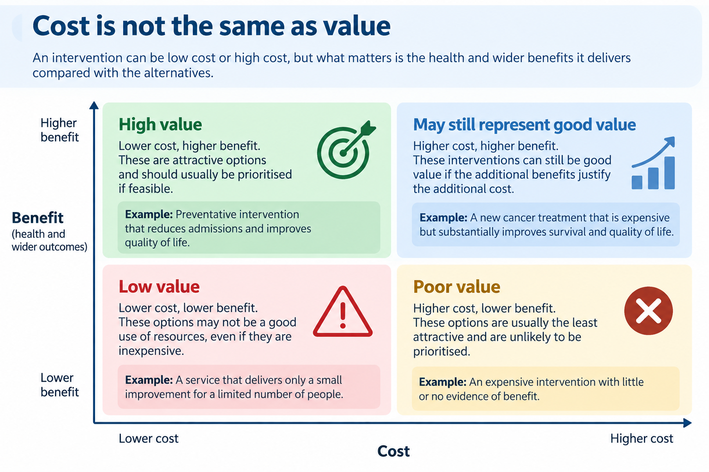
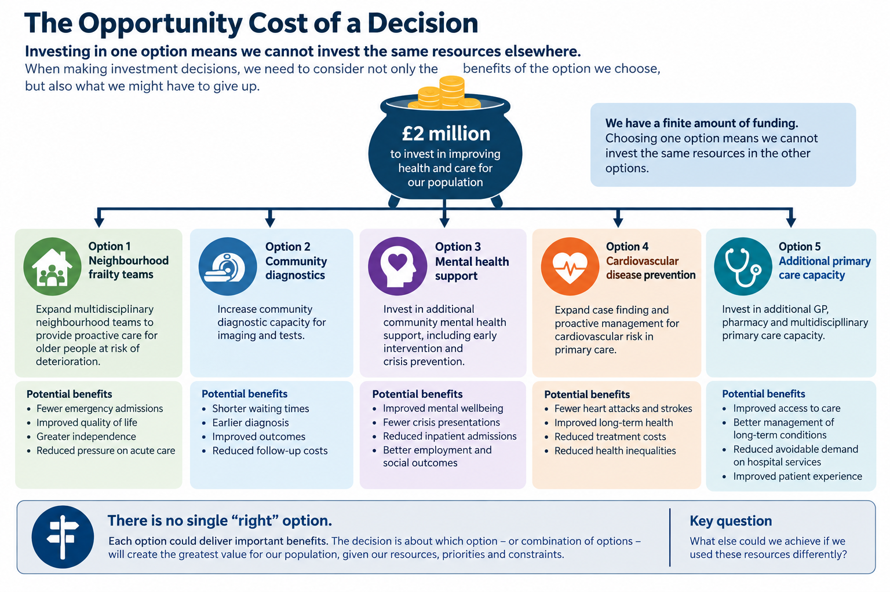
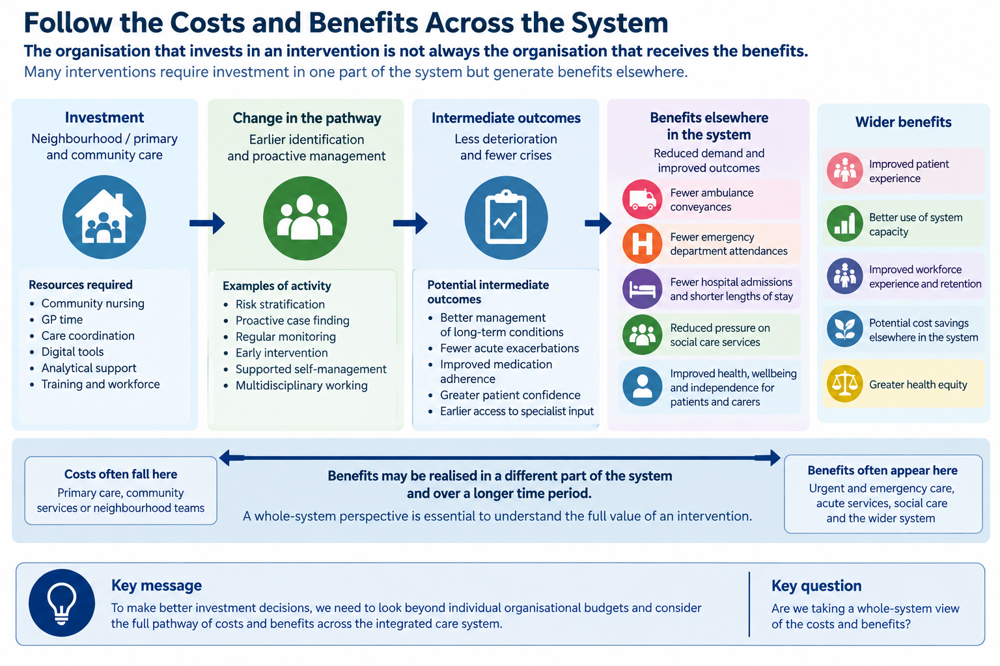
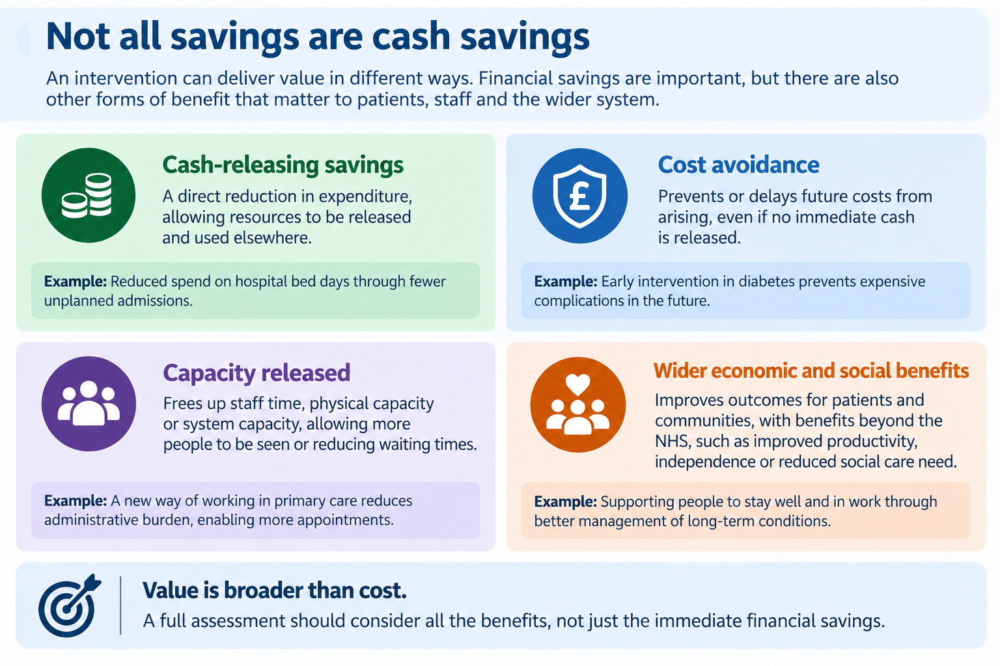
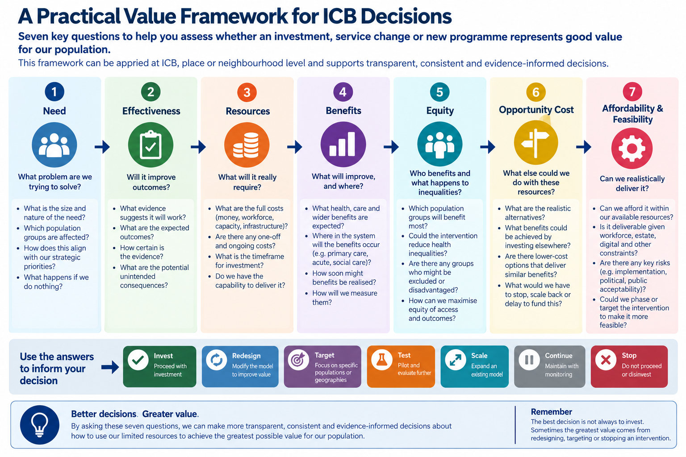

# Module 15: Health Economics & Value in Healthcare Decision-Making

## Is the improvement worth the investment?

<button class="print-button" onclick="window.print()">🖨️ Print this module</button>

## 1. Why Health Economics Matters

Throughout the previous module we explored how healthcare pathways can be understood, redesigned, implemented and evaluated.

Evaluation helps us answer an important question:

> **Did the intervention improve outcomes?**

However, demonstrating that an intervention works is only part of the decision.

Healthcare systems operate with limited financial resources, finite workforce capacity and competing priorities. Every investment made in one area means those resources cannot simultaneously be used somewhere else.

Decision-makers therefore face a further question:

> **Is this the best use of the resources available to improve outcomes for our population?**

Health economics provides a structured way of thinking about this question.

Rather than focusing solely on costs, it considers the relationship between the **resources used and the benefits achieved**, while also asking what else could have been achieved with those resources.

This matters because healthcare organisations constantly make choices about whether to:

- expand diagnostic services
- recruit additional staff
- invest in digital technology
- redesign healthcare pathways
- introduce new medicines
- expand community or neighbourhood services
- invest more in prevention
- continue, scale, redesign or stop existing services.

Most healthcare systems cannot fund every worthwhile initiative.

Choices therefore have to be made.

For Integrated Care Boards (ICBs), places and neighbourhoods, those choices can be particularly complex. Investment may be required in one part of the system while benefits are realised somewhere else.

For example, additional investment in neighbourhood, primary or community care may improve outcomes while reducing pressure on ambulance services, urgent and emergency care or hospital services.

An intervention may improve outcomes without saving money.

A service may appear inexpensive but deliver relatively little benefit.

And an intervention that produces good outcomes overall may still widen inequalities.

Health economics helps make these choices and trade-offs more explicit.

### From Evidence to Investment Decisions

*Figure 15.1: Evidence that an intervention works is only the beginning. Decision-makers must also consider resources, benefits, equity, opportunity cost and whether alternative uses of those resources could create greater value.*

### Health Economics Is About Value, Not Simply Cutting Costs

One of the most common misconceptions is that health economics is primarily concerned with reducing expenditure.

It is not.

Health economics is concerned with making the **best use of scarce resources**.

Sometimes the lowest-cost option represents poor value because it delivers relatively little benefit.

Equally, a more expensive intervention may represent better value if it substantially improves outcomes, prevents future illness, reduces inequalities or creates benefits elsewhere in the healthcare system.

The important question is therefore not simply:

> **How much does it cost?**

but:

> **What benefits are we likely to achieve from the resources we invest, compared with the realistic alternatives?**

::: {.callout-important collapse="false"}
## Key Principle

**The cheapest option is not necessarily the best value, and an intervention does not need to save money to represent good value.**

An intervention that improves outcomes is also not automatically the best investment.

The important question is whether the benefits achieved justify the resources required **compared with the alternatives available**.
:::

### Building on Previous Modules

This module builds directly on concepts introduced earlier in the series.

Modules 8 and 9 explored how interventions can be evaluated using robust evidence.

Module 14 demonstrated how healthcare pathways can be understood, redesigned, implemented and evaluated.

Health economics adds another perspective by asking:

- Which option is likely to deliver the greatest value?
- Are the additional benefits worth the additional resources?
- Who receives those benefits?
- Could the same resources produce greater benefit elsewhere?
- Is the intervention affordable and feasible?
- How will we know whether the expected value was actually realised?

This moves us from understanding **whether something works** towards deciding **whether it should be invested in, redesigned, targeted, scaled, continued or stopped**.

::: {.callout-tip collapse="false"}
## Decision-Maker Questions

Before approving an investment, ask:

- What problem are we trying to solve?
- Which population are we trying to benefit?
- What evidence suggests the intervention will work?
- What resources will it require?
- What benefits are expected?
- Where in the system will the costs and benefits occur?
- Who benefits, and what might happen to inequalities?
- What are the realistic alternatives?
- What else could these resources achieve?
- Is the intervention affordable and feasible?
- How will we know whether the expected value was actually realised?
:::

## Learning Objectives

By the end of this module, you should be able to:

- explain why health economics matters to ICB, place and neighbourhood decision-making
- distinguish between **cost, affordability, savings and value**
- understand the importance of **opportunity cost**
- identify costs and benefits occurring across organisational boundaries
- recognise why the **perspective** of an economic assessment matters
- consider **equity** alongside efficiency and value
- understand why health economics should be considered early in pathway and service design
- recognise when specialist health economics input may be valuable
- ask better questions when considering investment, redesign, scaling or disinvestment decisions.

The aim is **not to turn readers into health economists**.

It is to help decision-makers become more informed consumers of economic evidence, ask better questions and recognise when specialist health economics input could improve a decision.

## 2. Cost Is Not the Same as Value

A common mistake is to equate value with spending less.

But these are different concepts.

Value requires us to consider what is achieved **in relation to the resources used**.

A useful way to think about this is:

**Resources Used → Benefits Achieved → Value**

But benefits in healthcare are rarely limited to financial savings.

They may include:

- improved health outcomes
- improved quality of life
- earlier diagnosis
- avoided deterioration
- improved patient experience
- reduced inequalities
- reduced hospital utilisation
- increased independence
- improved workforce productivity
- increased capacity elsewhere in the pathway
- benefits to carers and families.

### Cost Is Not the Same as Value

*Figure 15.2: Cost alone does not determine value. A higher-cost intervention may still represent good value when the additional benefits justify the additional resources required.*

The figure illustrates why neither **low cost** nor **high benefit** should be considered in isolation.

A lower-cost intervention that delivers relatively little benefit may represent poor use of scarce resources. Conversely, a higher-cost intervention may still represent good value if the additional benefits are sufficiently important.

The comparison with **realistic alternatives** is therefore critical.

::: {.callout-important collapse="false"}
## Cost ≠ Value

A service can:

**cost more and still provide better value**

or

**cost less and still provide poor value.**

The important question is what we achieve with the resources available.
:::

## 3. Opportunity Cost: What Else Could We Do?

One of the most useful concepts health economics brings to healthcare decision-making is **opportunity cost**.

If £1 million is invested in one service, that £1 million cannot simultaneously be invested elsewhere.

The true cost of the decision therefore includes the **benefits that could have been achieved by using those resources differently**.

Imagine an ICB has £2 million available for investment.

Potential options might include:

- expanding neighbourhood frailty teams
- increasing community diagnostic capacity
- providing additional mental health support
- expanding proactive cardiovascular disease prevention
- increasing primary care capacity.

The decision is not simply:

> **Does the frailty programme provide benefits?**

It is:

> **How do the benefits of investing in the frailty programme compare with what we could achieve using those resources elsewhere?**

### The Opportunity Cost of a Decision

*When resources are finite, choosing one option means giving up some or all of the benefits that might have been achieved by investing those resources differently.*

::: {.callout-example collapse="false"}
## Example: The £1 Million Question

An ICB is considering investing £1 million in additional community capacity intended to reduce avoidable hospital admissions.

Evaluation suggests the programme is likely to improve patient experience and reduce some admissions.

That sounds positive.

But the investment decision still requires further questions.

**What else could £1 million achieve?**

Could it:

- prevent more admissions through another intervention?
- improve outcomes for a larger population?
- address a greater health inequality?
- release more clinical capacity?
- produce benefits sooner?

The existence of benefit does not, by itself, demonstrate that an intervention represents the **best use of scarce resources**.
:::

## 4. Follow the Costs and Benefits Across the System

This is particularly important in integrated care systems.

The organisation paying for an intervention may not be the organisation receiving the financial, operational or health benefit.

For example:

**Investment in neighbourhood, primary or community care**

↓

**Earlier identification and proactive management**

↓

**Reduced deterioration and fewer crises**

↓

**Potential benefits elsewhere in the pathway**

- fewer ambulance conveyances
- fewer emergency department attendances
- fewer unplanned admissions
- shorter lengths of stay
- reduced pressure on social care
- improved patient and carer experience
- improved population outcomes.

The costs may therefore occur in one part of the system while benefits appear elsewhere.

Looking only at individual organisational budgets can consequently lead to poor system decisions.

### Follow the Costs and Benefits Across the System

*Investment in one part of an integrated care system may generate health, operational and financial benefits elsewhere and over a different time period.*

### The Perspective Matters

Economic analysis therefore needs to be clear about **whose costs and benefits are being considered**.

Possible perspectives include:

- individual service
- provider
- commissioner
- ICB
- NHS
- health and social care
- wider public sector
- patient and family
- society.

The conclusion can change depending on the perspective chosen.

::: {.callout-example collapse="false"}
## Example: A Neighbourhood Intervention

Suppose a neighbourhood team introduces proactive support for people with complex needs.

It requires additional:

- community nursing
- GP time
- care coordination
- analytical support.

The intervention may therefore initially appear to **increase costs**.

But potential benefits might include:

- fewer emergency admissions
- fewer ambulance journeys
- reduced duplication
- improved medication management
- improved patient experience
- greater independence
- reduced pressure on carers.

If we examine only the neighbourhood team's resources, the intervention may look expensive.

If we examine the **whole pathway and wider system**, the value proposition may look very different.
:::

::: {.callout-important collapse="false"}
## Think System, Not Organisation

A change should not automatically be considered poor value because the organisation funding it does not receive the financial benefit.

Equally, shifting costs from one part of the system to another does not necessarily create value.

For integrated care systems, the important question is:

**What happens to resources, outcomes and inequalities across the whole pathway?**
:::

## 5. Financial Savings Are Not the Same as Economic Benefits

Another important distinction is between:

**financial impact**

and

**economic value**.

Suppose an intervention prevents 100 hospital admissions.

It may be tempting to multiply:

**100 × average admission cost**

and describe the result as a cash saving.

But healthcare costs do not always behave like this.

Preventing activity may release capacity without immediately reducing expenditure.

Staff may still be employed.

Buildings still operate.

Fixed costs remain.

The released capacity may instead allow the system to:

- treat other patients
- reduce waiting lists
- absorb rising demand
- improve resilience
- reduce pressure on staff.

That still has value.

But it is not necessarily a **cash-releasing saving**.

### Not All Savings Are Cash Savings

*Figure 15.5: Interventions can create value in different ways. Cash-releasing savings, cost avoidance, released capacity and wider economic and social benefits should not be treated as interchangeable.*

The distinction matters because different types of benefit have different implications for decision-making.

For example, reducing hospital activity may create valuable **capacity** that can be used to treat other patients without reducing the hospital's expenditure. Similarly, preventing future demand may represent **cost avoidance**, even though no money is immediately released from a budget.

Wider benefits may also occur beyond the organisation—or even beyond the NHS—through improved independence, productivity, wellbeing or reduced need for other public services.

::: {.callout-important collapse="false"}
## Avoid False Savings

When assessing the impact of an intervention, distinguish between:

**Cash-releasing savings**  
Actual expenditure that can genuinely be removed from a budget.

**Cost avoidance**  
Future expenditure or additional resource requirements that may no longer be needed.

**Capacity released**  
Resources that become available to treat other patients or undertake other activities.

**Wider economic and social benefits**  
Benefits to patients, families, communities or the wider system that may not appear directly in an NHS budget.

These concepts should not be treated as interchangeable.
:::

::: {.callout-tip collapse="false"}
## Decision-Maker Questions

When someone claims that an intervention will "save money", ask:

- Is this genuinely a cash-releasing saving?
- Or are we actually releasing capacity?
- Are we avoiding future costs rather than reducing current expenditure?
- Where in the system will the benefit occur?
- When will the benefit be realised?
- Can released capacity actually be used for something else?
- Are there wider benefits that will not appear in an NHS budget?
:::

## 6. Think About Marginal Decisions

Most ICB decisions are not:

> **Should healthcare provide this service at all?**

They are more often:

> **Should we provide more or less of it?**

Examples include:

- one additional neighbourhood team
- 10 additional virtual ward beds
- extending pharmacy support to another locality
- expanding case finding to another risk group
- increasing diagnostic capacity
- extending opening hours.

Health economics describes this as thinking **at the margin**.

The practical question becomes:

> **What additional benefit will we achieve from the next unit of resource we invest?**

This can produce better decisions than simply comparing entire programmes.

For example, the first expansion of a service may produce substantial benefits because it reaches a population with significant unmet need.

Further expansion may still produce benefits, but progressively smaller ones.

The question is therefore not simply whether a service is valuable.

It is whether **additional investment in that service represents better value than the alternatives available at that point in time**.

## 7. Value Depends on Who Benefits

A programme can produce good average outcomes while distributing those benefits unequally.

For example, a digital intervention may produce excellent outcomes among people who engage with it.

But what if engagement is lower among:

- older people
- people experiencing deprivation
- people with limited digital access
- people with language barriers
- people with severe mental illness
- people with multiple long-term conditions?

The average result may conceal an important equity issue.

Economic thinking therefore needs to consider both:

### Efficiency

**How much benefit are we achieving from the resources available?**

and

### Equity

**How are those benefits distributed across the population?**

::: {.callout-tip collapse="false"}
## Ask "For Whom?"

Do not stop at:

**Does it work?**

Ask:

- **For whom does it work?**
- **Who benefits most?**
- **Who may be excluded?**
- **Could implementation widen existing inequalities?**
- **Would targeting resources differently create greater population benefit?**
:::

This connects health economics directly with **Population Health Management**, which is explored later in the series.

## 8. Affordability and Value Are Different Questions

An intervention can represent good value and still be unaffordable.

Similarly, something affordable does not necessarily represent good value.

These should therefore be considered separately.

### Value

> **Are the expected benefits worth the resources required compared with the alternatives?**

### Affordability

> **Can the system actually fund and deliver this within its available resources?**

Imagine an intervention has strong evidence and is expected to produce substantial benefits.

Scaling it across an entire ICB might require:

- £10 million
- 80 additional staff
- additional estate
- new digital infrastructure.

It might represent good value.

But if the workforce or funding does not exist, full implementation may not be feasible.

This leads to another decision:

> **Could we target the intervention differently, phase implementation or redesign the model to retain most of the benefit at a feasible cost?**

Health economics can therefore contribute not just to **whether** we invest, but **how** we design the intervention.

::: {.callout-important collapse="false"}
## Good Value Does Not Automatically Mean Affordable

These are two different questions.

A proposal may represent excellent value but still exceed the resources available.

Conversely, an intervention may be inexpensive enough to fund but deliver too little benefit to justify continuing it.
:::

## 9. Health Economics Should Start Before Implementation

Economic evaluation is sometimes considered only after an intervention has already been implemented.

By then, important opportunities may have been lost.

Before implementation, teams can ask:

**What decision will the evaluation need to inform?**

↓

**What outcomes matter?**

↓

**Whose costs and benefits matter?**

↓

**What alternatives should be compared?**

↓

**What resources need to be measured?**

↓

**What baseline information is required?**

↓

**How will benefits be assessed?**

↓

**What follow-up period is appropriate?**

This is why health economists, evaluators and analysts can add most value when involved **during intervention and pathway design**, rather than simply being asked afterwards:

> **"Can you prove this saved money?"**

::: {.callout-important collapse="false"}
## Design Evaluation and Economics Together

The **Theory of Change** tells us how the intervention is expected to create change.

The **evaluation** tells us whether those changes occurred.

The **economic evaluation** helps us understand whether the benefits achieved justified the resources used.

These questions should ideally be designed together.
:::

## 10. A Practical Value Framework for ICB Decisions

For many investment and service-change decisions, decision-makers do not initially need a complex economic model.

A structured set of questions can help determine whether a proposal is likely to represent good value and whether more detailed economic analysis is required.

The following seven questions can be applied at **ICB, place or neighbourhood level**.

### A Practical Value Framework for ICB Decisions

*Seven questions can help decision-makers assess whether an investment, service change or programme represents good value for the population.*

::: {.callout-example collapse="false"}
## The Seven Questions of Value

### 1. Need — What problem are we trying to solve?

Consider:

- What is the size and nature of the need?
- Which population groups are affected?
- How does this align with strategic priorities?
- What happens if we do nothing?

### 2. Effectiveness — Will it improve outcomes?

Consider:

- What evidence suggests the intervention will work?
- What outcomes are expected?
- How certain is the evidence?
- Are there any potential unintended consequences?

### 3. Resources — What will it really require?

Consider:

- What are the full costs, including money, workforce, capacity and infrastructure?
- Are there one-off and ongoing costs?
- What is the expected timeframe for investment?
- Do we have the capability to deliver it?

### 4. Benefits — What will improve, and where?

Consider:

- What health, care and wider benefits are expected?
- Where in the system will those benefits occur?
- How soon might benefits be realised?
- How will they be measured?

### 5. Equity — Who benefits?

Consider:

- Which population groups are likely to benefit most?
- Could the intervention reduce health inequalities?
- Are there groups who may be excluded or disadvantaged?
- How can equity of access and outcomes be maximised?

### 6. Opportunity Cost — What else could we do with these resources?

Consider:

- What are the realistic alternatives?
- What benefits could be achieved by investing elsewhere?
- Are there lower-cost options that could deliver similar benefits?
- What would we have to stop, scale back or delay to fund this?

### 7. Affordability & Feasibility — Can we realistically deliver it?

Consider:

- Can we afford it within available resources?
- Is it deliverable given workforce, estate, digital and other constraints?
- Are there significant implementation or acceptability risks?
- Could the intervention be phased, targeted or redesigned to make it more feasible?
:::

### Use the Answers to Inform the Decision

The purpose of the framework is not simply to decide whether to **invest**.

Depending on the answers, the appropriate decision may be to:

**Invest → Redesign → Target → Test → Scale → Continue → Stop**

The best decision is therefore not always to fund a proposal exactly as presented.

Sometimes greater value may come from:

- redesigning the intervention
- targeting it at a different population
- testing it at smaller scale
- scaling an intervention that is already working
- continuing with further monitoring
- stopping or disinvesting from an intervention that is not delivering sufficient value.

::: {.callout-important collapse="false"}
## Key Principle

A good investment decision considers the **whole picture**:

**Need + Effectiveness + Resources + Benefits + Equity + Opportunity Cost + Affordability & Feasibility**

The aim is to use limited resources in the way most likely to improve outcomes and create the greatest value for patients and populations.
:::

## 11. When Do We Need a Health Economist?

Not every decision requires a full economic evaluation.

But specialist input becomes increasingly valuable when:

- investment is substantial
- several competing options exist
- costs and benefits occur in different organisations
- outcomes are difficult to assess or value
- benefits occur over long periods
- uncertainty is substantial
- an intervention may need to be scaled
- important equity trade-offs exist
- commissioners are considering disinvestment
- a decision has significant consequences for future resource allocation.

::: {.callout-tip collapse="false"}
## Involve Health Economics Early When the Decision Matters

The purpose of involving a health economist is not simply to produce a cost-effectiveness calculation.

They can help teams think more clearly about:

**the decision → alternatives → resources → outcomes → uncertainty → equity → value**

before an intervention is implemented.
:::

## 12. Economic Evaluation: Terms You May Encounter

This module is not intended to teach the technical methods of economic evaluation.

However, decision-makers may encounter several common terms when working with health economists or reading economic evidence.

### Cost-Effectiveness Analysis

Compares the **costs and outcomes** of different options where outcomes can be measured in a relevant natural unit.

Examples might include:

- cost per admission avoided
- cost per additional diagnosis
- cost per patient successfully treated.

### Cost-Utility Analysis

A type of economic evaluation in which outcomes are expressed using a common measure that incorporates health-related quality and quantity of life.

This is where readers may encounter terms such as **Quality-Adjusted Life Years (QALYs)**.

QALYs are particularly prominent in national technology appraisal, but they are only one way of considering value and will not always be the most useful measure for a local ICB, place or neighbourhood decision.

### Cost-Benefit Analysis

Attempts to express both costs and benefits in monetary terms so that they can be compared directly.

This can allow different types of benefit to be considered using a common unit, although placing monetary values on some health and social outcomes can be challenging.

### Cost-Consequence Analysis

Presents different costs and outcomes separately rather than combining them into a single measure.

For example, a decision-maker might be presented with:

- programme cost
- admissions avoided
- bed days released
- patient experience
- workforce impact
- impact on inequalities.

This can be particularly useful for local system decisions because it allows decision-makers to see **different dimensions of value alongside one another**, rather than reducing everything to a single number.

::: {.callout-note collapse="false"}
## You Do Not Need to Become a Health Economist

For most ICB, place and neighbourhood decision-makers, the important skill is not being able to calculate each form of economic evaluation.

It is being able to ask:

- **What question is this analysis answering?**
- **What alternatives are being compared?**
- **Whose costs and benefits are included?**
- **What outcomes have been included—and what has been left out?**
- **What assumptions have been made?**
- **How uncertain are the results?**
- **And is this evidence relevant to the decision we actually need to make?**
:::

## 13. Uncertainty Matters

Economic cases inevitably rely on assumptions.

We may have to estimate:

- future demand
- uptake
- intervention effectiveness
- workforce requirements
- unit costs
- admissions avoided
- future benefits
- implementation timescales.

These estimates will rarely be perfectly accurate.

A business case that produces a single number can therefore create a false impression of certainty.

For example:

> **"The intervention will save £2.3 million."**

may appear precise.

But the result may depend heavily on assumptions about uptake, effectiveness, activity reduction and whether released capacity genuinely translates into financial savings.

A better question is:

> **How sensitive is our conclusion to the assumptions we have made?**

This is the purpose of **sensitivity analysis**.

Rather than asking only what happens under our preferred assumptions, we can explore:

- What if uptake is lower?
- What if implementation takes longer?
- What if costs are higher?
- What if the effect is smaller than expected?
- What if benefits take longer to emerge?

::: {.callout-tip collapse="false"}
## Look for the Decision That Survives Uncertainty

The aim is not to eliminate uncertainty.

It is to understand whether the preferred decision remains reasonable when plausible assumptions change.

If a small change in one assumption completely reverses the conclusion, decision-makers should know that before committing significant resources.
:::

## 14. From Business Case to Learning System

An investment decision should not be the end of the economic question.

Suppose a programme was approved because it was expected to:

- cost £1.5 million
- reduce emergency activity
- improve patient outcomes
- release capacity
- reduce inequalities.

Those assumptions become **testable propositions**.

After implementation we can ask:

**Expected resources → Actual resources**

**Expected reach → Actual reach**

**Expected outcomes → Actual outcomes**

**Expected savings or capacity → Actual savings or capacity**

**Expected equity impact → Actual equity impact**

The economic case can therefore become part of the evaluation framework.

This creates a healthier cycle:

**Need → Design → Investment Decision → Implementation → Evaluation → Value Realisation → Adapt / Scale / Stop**

rather than:

**Business Case → Funding → Implementation → Move On**

::: {.callout-tip collapse="false"}
## Revisit the Original Value Proposition

After implementation, return to the assumptions that supported the original investment decision.

Ask:

- Did the intervention cost what we expected?
- Did it reach the intended population?
- Were the expected outcomes achieved?
- Were benefits realised where we expected them?
- Was capacity actually released?
- Were inequalities reduced or widened?
- Would we make the same investment decision again?

This turns economic thinking into part of **continuous learning**, rather than a one-off business case exercise.
:::

## Bringing It All Together

Health economics is not simply about calculating whether something is "cost-effective".

For ICBs, places and neighbourhoods, it provides a way of thinking more systematically about how scarce resources can create the greatest value for patients and populations.

It encourages decision-makers to move beyond questions such as:

> **How much does it cost?**

towards:

> **What will we achieve?**

> **For whom?**

> **At what resource cost?**

> **Compared with what?**

> **What else could those resources achieve?**

> **Can we afford and implement it?**

> **How uncertain are we?**

> **And how will we know whether the expected value was actually realised?**

::: {.callout-tip collapse="false"}
## Questions to Ask Before the Next Investment Decision

1. **What problem are we trying to solve?**
2. **Which population are we trying to benefit?**
3. **What are our realistic options—including doing something different?**
4. **What evidence supports the expected benefits?**
5. **What resources will each option require?**
6. **Where will the costs occur?**
7. **Where will the benefits occur?**
8. **What capacity might be released—and is it genuinely cash-releasing?**
9. **Who benefits, and what happens to inequalities?**
10. **What else could we achieve with these resources?**
11. **Can we realistically afford and implement the intervention?**
12. **How sensitive is the case to our assumptions?**
13. **What evidence will we collect to determine whether the expected value was realised?**
:::

## Key Takeaways

- **Health economics is fundamentally about choices under constrained resources.**
- **Cost, affordability, financial savings and value are different concepts.**
- An intervention does not need to save money to provide good value.
- **Opportunity cost matters:** investing resources in one area means forgoing benefits elsewhere.
- Costs and benefits frequently occur in **different parts of an integrated care system**.
- Economic assessments should therefore be explicit about the **perspective** being taken.
- Released capacity should not automatically be described as a cash saving.
- Value should consider **equity as well as efficiency**.
- **Affordability and value are different questions.**
- Economic evidence contains uncertainty, and important assumptions should be tested.
- Health economics can help design interventions, not simply evaluate them afterwards.
- Theory of Change, evaluation and economic evaluation should ideally be considered together.
- Not every decision needs a complex economic model—but **every significant investment decision benefits from economic thinking**.

::: {.callout-important collapse="false"}
## The Question to Remember

When considering an investment, do not ask only:

**"Does it work?"**

Ask:

**"Is this the best use of the resources available to improve outcomes for our population?"**
:::

## Useful Resources

This module provides an introduction to health economic thinking for non-specialists rather than a technical guide to conducting economic evaluation.

The following resources provide more detailed guidance.

### HM Treasury — The Green Book

The **Green Book** provides UK government guidance on how proposals involving public resources should be appraised.

It is particularly useful for understanding:

- options appraisal
- costs and benefits
- value for money
- opportunity cost
- distributional and place-based impacts
- uncertainty and sensitivity analysis
- monitoring and evaluation.

The Green Book is broader than health economics and is particularly relevant where decisions involve public resources across organisational or sector boundaries.

<https://www.gov.uk/government/publications/the-green-book-appraisal-and-evaluation-in-central-government>

### NHS Evaluation Toolkit — Economic Evaluation

The **NHS Evaluation Toolkit** provides practical guidance for people planning and undertaking evaluation within health and care.

Its economic evaluation resources can help teams consider how costs, outcomes and value can be incorporated into evaluation planning.

<https://nhsevaluationtoolkit.net/>

### GOV.UK — Economic Evaluation: Health Economic Studies

This practical guidance introduces economic evaluation and explains how costs and effects can be compared between an intervention and its alternatives.

It includes guidance on:

- planning an economic evaluation
- measuring costs and effects
- defining the boundaries of an evaluation
- incremental analysis
- different forms of economic evaluation.

<https://www.gov.uk/guidance/economic-evaluation-health-economic-studies>

### GOV.UK — Economic Evaluation in Health and Wellbeing

This resource provides an accessible introduction to applying economic evaluation to health and wellbeing interventions.

It is particularly useful for understanding:

- scarcity
- opportunity cost
- economic evaluation
- assessing value
- challenges when evaluating complex public health interventions.

<https://www.gov.uk/guidance/evaluation-in-health-and-wellbeing-economics>

::: {.callout-note collapse="false"}
## Use Guidance Proportionately

Not every neighbourhood service change requires a sophisticated economic model.

The depth of analysis should be proportionate to the **scale of the investment, complexity of the decision, level of uncertainty and consequences of getting the decision wrong**.

For smaller decisions, the **Seven Questions of Value** introduced in this module may provide a useful starting point.

For larger, higher-risk or strategically important decisions, specialist health economics input and more formal appraisal may be appropriate.
:::

## The Bigger Picture

Health economics is one component of **Healthcare Decision Intelligence**.

It cannot tell us, on its own, what decision should be made.

Decision-makers may need to combine:

**Population Need**

+

**Quantitative Evidence**

+

**Qualitative Evidence & Lived Experience**

+

**Evaluation**

+

**Clinical & Professional Expertise**

+

**Health Economics**

+

**Equity**

+

**Uncertainty**

↓

**Better-Informed Decisions**

Economic evidence helps us understand the consequences of using scarce resources in different ways.

But ultimately, decisions still require judgement.

The goal is not to replace that judgement with a formula.

It is to make the evidence, assumptions, alternatives and trade-offs **more visible and explicit**, so that decisions can be better informed, more transparent and more defensible.

That is the role of health economics within **Healthcare Decision Intelligence**.
