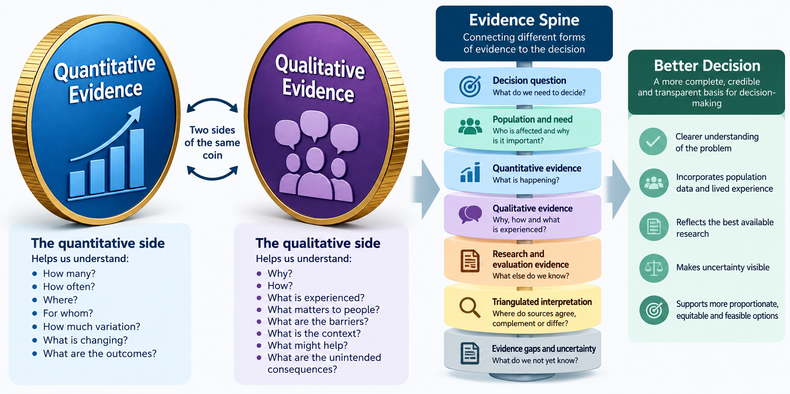

# Module 20: Bringing Evidence Together

## Building an evidence spine for better healthcare decisions

<button class="print-button" onclick="window.print()">🖨️ Print this module</button>

> **How do we combine different forms of evidence into a coherent picture?**

## 1. Why This Module Matters

Healthcare decisions are rarely adequately explained by a single dataset, metric or research study.

Decision-makers may know that:

- emergency admissions are increasing
- referral rates differ between localities
- uptake of a service is lower in some population groups
- waiting times have increased
- outcomes differ between pathways
- a new intervention appears to be associated with improvement.

These findings are important. But they often lead to another question:

> **Why?**

Quantitative analysis can identify the **scale, distribution and pattern** of a problem. It can show how many, how often, where, when, for whom, whether something is changing and whether variation exists.

But numbers alone may not explain why people do not access a service, why clinicians use pathways differently, why an intervention works well in one place but not another, why apparently similar populations experience different outcomes, how patients experience a pathway, what implementation barriers exist, or whether the outcomes being measured are the outcomes that matter most to people.

Qualitative evidence can help answer these questions.

::: {.callout-important collapse="false"}
## Key Principle

**Quantitative and qualitative evidence are not competing forms of evidence.**

They are different ways of understanding the same healthcare system.

Quantitative evidence can help us understand **what is happening, how much, where and for whom**.

Qualitative evidence can help us understand **how, why and under what circumstances it is happening**.

Healthcare Decision Intelligence requires both.
:::

## Learning Objectives

By the end of this module, you should be able to:

- understand why healthcare decisions often require multiple forms of evidence
- distinguish quantitative and qualitative evidence without creating an artificial hierarchy between them
- recognise different sources of qualitative evidence
- understand the role of patient and community insight
- understand the role of professional and operational insight
- use literature and existing research alongside local evidence
- recognise the difference between anecdote and systematically gathered qualitative evidence
- understand triangulation
- identify agreement, complementarity and disagreement between evidence sources
- construct an evidence spine around a healthcare decision
- identify important evidence gaps
- communicate a balanced evidence picture to decision-makers.

# 2. Two Sides of the Same Coin

Quantitative and qualitative evidence are sometimes treated as if they sit in separate analytical worlds. They should not.

A useful way to think about them is as **two sides of the same coin**.

```{mermaid}
flowchart LR
    QN["QUANTITATIVE EVIDENCE<br/><br/>How many?<br/>How often?<br/>Where?<br/>For whom?<br/>How much variation?<br/>What changed?"]
    C(("UNDERSTANDING<br/>THE POPULATION<br/>AND SYSTEM"))
    QL["QUALITATIVE EVIDENCE<br/><br/>Why?<br/>How?<br/>What was experienced?<br/>What matters?<br/>What are the barriers?<br/>What is the context?"]
    QN --> C
    QL --> C
```

**Quantitative evidence** might tell us that uptake of a community service is 30% lower in one population group.

**Qualitative evidence** might help explain why. For example, people may not understand the service; referral processes may be difficult to navigate; transport may be a barrier; appointment times may be unsuitable; clinicians may apply eligibility criteria differently; or previous experiences may affect willingness to engage.

Neither form of evidence provides the complete picture on its own.

::: {.callout-important collapse="false"}
## Two Sides of the Same Coin

**Numbers tell us about patterns.**

**People and context help us understand those patterns.**

Bringing the two together gives decision-makers a more complete understanding of the problem.
:::

# 3. Different Evidence Answers Different Questions

The purpose of combining evidence is not to collect as much information as possible. It is to answer the **decision question**.

| Question | Potential evidence |
|---|---|
| How large is the problem? | Population data, activity, prevalence, rates |
| Who is most affected? | Demographic, clinical, geographical and inequality analysis |
| Where does variation exist? | Comparative quantitative analysis |
| What has changed? | Trends, evaluation, outcome data |
| Why might this be happening? | Interviews, focus groups, operational insight |
| What do patients experience? | Patient stories, engagement findings, complaints, interviews |
| What matters to communities? | Community engagement, voluntary sector insight |
| What do professionals observe? | Clinical and operational insight |
| What does wider research tell us? | Literature reviews, published studies, guidelines |
| Did an intervention make a difference? | Evaluation evidence |
| What might happen if we change the system? | Scenario and simulation modelling |
| What remains uncertain? | Evidence gaps, conflicting findings, sensitivity analysis |

No single evidence source is expected to answer all of these questions. The objective is to construct a coherent picture from the sources most relevant to the decision.

# 4. What Counts as Qualitative Evidence?

Qualitative evidence is broader than formal interviews and focus groups. Healthcare organisations already hold substantial qualitative intelligence. The challenge is often recognising it, accessing it and using it systematically.

## Patient and Public Experience

Examples include patient interviews, focus groups, listening exercises, patient stories, community conversations, engagement exercises, public consultations, surveys containing free-text responses, complaints, compliments, Patient Advice and Liaison Service information and Healthwatch reports.

These sources can provide insight into barriers to access, experiences of care, communication, continuity, dignity, trust, preferences and outcomes that matter to patients.

## Community and Voluntary Sector Insight

Voluntary, community, faith and social enterprise organisations may hold important knowledge about populations that healthcare services do not routinely see.

This might include barriers experienced by particular communities, unmet need, reasons for low service uptake, social circumstances, trust in services, digital exclusion, transport, language and cultural factors.

These organisations may act as **trusted intermediaries** between communities and statutory organisations. Their existing insight can therefore be an important component of the evidence picture.

## Professional and Clinical Insight

Healthcare professionals observe the system from within. Potential sources include clinicians, nurses, pharmacists, allied health professionals, care coordinators, social care professionals and primary care teams.

They may identify pathway problems, inappropriate referrals, gaps between services, duplicated processes, eligibility problems, unintended consequences and changing patient complexity.

Professional opinion should not automatically be treated as fact. But neither should it be dismissed simply because it is not quantitative. It can provide important hypotheses and contextual explanations that can subsequently be tested against other evidence.

## Operational Insight

Operational teams often understand practical constraints that are poorly represented in routine datasets. Examples include workforce constraints, referral processes, administrative delays, scheduling problems, capacity constraints, pathway workarounds and data recording practices.

This can be particularly important when quantitative data show unexplained variation.

## Formal Qualitative Research

More structured approaches include:

- semi-structured interviews
- in-depth interviews
- focus groups
- observation
- ethnographic approaches
- case studies.

These approaches allow researchers to explore experiences, mechanisms and context systematically.

## Existing Engagement Evidence

New engagement should not automatically be the first response to every evidence gap.

Relevant engagement may already have been undertaken by NHS organisations, local authorities, Healthwatch, voluntary organisations, community organisations, universities, charities and service providers.

The first question can therefore be:

> **What do we already know?**

rather than:

> *Who should we ask again?*

## Literature and Existing Research

Qualitative evidence also exists within published research. Literature reviews can identify known barriers to access, patient experiences, implementation challenges, behavioural factors, mechanisms through which interventions may work and evidence from similar populations or settings.

Local qualitative evidence and published research can therefore complement one another.

::: {.callout-important collapse="false"}
## Existing Insight Has Value

**Do not assume that every decision requires a new engagement exercise.**

Start by understanding what patients, communities, professionals and researchers have already told us.

Then identify what remains unknown.
:::

# 5. Qualitative Evidence Is More Than Anecdote

A common criticism of qualitative evidence is:

> *That's just anecdotal.*

Sometimes it is. One individual's experience should not automatically be assumed to represent an entire population.

But systematically gathered qualitative evidence is different from an isolated anecdote. Its strength can be improved through clear questions, transparent sampling, inclusion of diverse perspectives, systematic coding or thematic analysis, documentation of methods, searching for contradictory views, comparing findings across sources and triangulation with quantitative evidence.

The objective is not necessarily to estimate **how many people** hold a particular view. It may instead be to understand:

> **What experiences exist, why they occur, and what they might mean for the decision.**

::: {.callout-important collapse="false"}
## Different Evidence Requires Different Tests

We should not judge qualitative evidence using exactly the same criteria used for quantitative analysis.

The relevant questions include:

- Whose voices are represented?
- Whose voices might be missing?
- How was the evidence gathered?
- Are themes consistent across sources?
- Are contradictory experiences visible?
- Is the interpretation transparent?
- Does other evidence support or challenge the findings?
:::

# 6. What Is an Evidence Spine?

An **evidence spine** provides a structured connection between the decision being considered and the evidence supporting it.

It prevents decision-making from becoming a collection of disconnected statistics, reports and opinions.

Quantitative and qualitative evidence are sometimes treated as if they sit in separate analytical worlds.

They should not.

A useful way to think about them is as **two sides of the same coin**.



The evidence spine does not imply that evidence is always linear. Rather, it creates a disciplined way of asking:

1. What decision are we trying to make?
2. What do we know about the population and need?
3. What does the quantitative evidence tell us?
4. What does qualitative evidence tell us?
5. What does existing research and evaluation tell us?
6. Where do these sources agree?
7. Where do they provide different but complementary information?
8. Where do they conflict?
9. What remains uncertain?
10. What does this collectively mean for the decision?

# 7. Triangulation: Looking Across the Evidence

Triangulation means examining a question using more than one source or form of evidence. The purpose is not simply to see whether everything agrees.

## Convergence

Different evidence sources point towards a similar conclusion.

**Quantitative evidence:** uptake of a service is substantially lower in deprived neighbourhoods.

**Qualitative evidence:** patients report transport and appointment-time barriers.

**Professional insight:** staff report difficulty reaching people who cannot attend standard clinic appointments.

Together, these strengthen the hypothesis that **access may be contributing to lower uptake**.

## Complementarity

Different evidence sources tell different parts of the story.

**Quantitative evidence:** emergency admissions are higher among people living with severe frailty.

**Qualitative evidence:** patients and carers describe difficulty obtaining support during deterioration outside normal working hours.

The qualitative evidence does not simply confirm the quantitative result. It adds an explanation that was not visible in the numbers.

## Disagreement

Evidence sources may conflict.

**Routine data:** access appears broadly similar between two populations.

But **community insight:** one population reports substantial difficulty accessing the service.

This should not automatically lead us to discard one source. Instead ask whether we are measuring the right form of access, whether the dataset captures unsuccessful attempts to access care, whether averages conceal subgroup differences, whether the qualitative evidence is drawn from a particular population, whether the service has changed recently, or whether there are data quality problems.

::: {.callout-important collapse="false"}
## Disagreement Is Useful Evidence

**Triangulation is not about forcing all evidence to agree.**

Disagreement can reveal measurement problems, hidden inequalities, different perspectives, missing variables, evidence gaps and incorrect assumptions.

Sometimes the most useful insight comes from asking:

> **Why don't these sources agree?**
:::

# 8. Worked Example: Understanding Emergency Admissions Among People Living with Frailty

Consider an ICB trying to answer:

> **Why are emergency admissions among people living with frailty higher in some neighbourhoods, and where might intervention make the greatest difference?**

## Step 1 — Establish the Quantitative Picture

Analysis finds that emergency admission rates are higher in several neighbourhoods. These neighbourhoods also have older populations; severe frailty is more prevalent; multimorbidity is higher; deprivation is higher in some areas; and community service utilisation varies substantially.

After adjusting for age and other available measures of need, some variation remains.

This tells decision-makers **where the problem appears greatest and which populations are most affected**, but it does not fully explain why.

## Step 2 — Review Existing Qualitative Evidence

Rather than immediately commissioning new engagement, the Insight team reviews existing sources, including Healthwatch reports, previous patient engagement, voluntary sector intelligence, complaints and free-text feedback, community service reviews, published qualitative research on frailty and existing interviews with carers.

Several themes emerge:

- difficulty navigating services
- carers being unsure whom to contact during deterioration
- concerns about accessing support outside normal hours
- poor continuity between services
- patients repeating their story to multiple professionals.

These themes provide potential explanations for some of the observed quantitative patterns.

## Step 3 — Gather Professional and Operational Insight

Discussions with professionals identify additional issues:

- variation in referral thresholds
- differences in awareness of community alternatives
- inconsistent availability of rapid response services
- workforce constraints
- variation in how frailty is recorded.

This generates hypotheses that can be checked against available data. For example:

> **Do areas with lower UCR utilisation have higher emergency admission rates after accounting for population need?**

The qualitative evidence has therefore generated a **testable analytical question**.

## Step 4 — Look for Convergence and Difference

| Evidence | Finding | What it contributes |
|---|---|---|
| Population analysis | Higher frailty and multimorbidity in some areas | Explains part of variation |
| Admission analysis | Variation remains after adjusting for available need measures | Suggests further investigation |
| Community activity | UCR utilisation differs between areas | Identifies possible pathway variation |
| Patient/carer insight | Difficulty accessing urgent support | Suggests potential mechanism |
| Professional insight | Referral thresholds vary | Suggests pathway explanation |
| Operational evidence | Workforce availability differs | Provides implementation context |
| Literature | Timely community support may help some people remain at home | Provides external evidence |

No single row answers the commissioning question. Together they create a much stronger evidence picture.

## Step 5 — Construct the Evidence Spine

> **Population need**
>
> Older population + frailty + multimorbidity
>
> ↓
>
> **Observed pattern**
>
> Higher emergency admissions in some neighbourhoods
>
> ↓
>
> **Unexplained variation**
>
> Population need explains some, but not all, of the difference
>
> ↓
>
> **Qualitative insight**
>
> Patients and carers describe difficulties accessing timely support
>
> ↓
>
> **Professional and operational insight**
>
> Referral practices and community capacity vary
>
> ↓
>
> **External evidence**
>
> Timely community responses may support some people safely at home
>
> ↓
>
> **Intervention hypothesis**
>
> More consistent access to proactive and urgent community support may reduce avoidable escalation for some people with frailty
>
> ↓
>
> **Decision**
>
> Consider whether targeted pathway redesign should be developed and evaluated.

Notice what the evidence spine **does not** say:

> *Community services will definitely reduce emergency admissions.*

The evidence supports a plausible intervention hypothesis. It does not remove uncertainty.

# 9. Evidence Should Generate Better Questions

One of the most useful relationships between quantitative and qualitative evidence is that each can generate questions for the other.

**Quantitative finding:** service uptake is unexpectedly low in one locality.

This generates a qualitative question:

> **Why are people not using the service?**

Qualitative investigation might identify transport and opening hours as important barriers.

That generates another quantitative question:

> **Is lower uptake concentrated among people living further from the service or among particular population groups?**

The process becomes iterative:

> **Quantitative → Qualitative → New hypothesis → Quantitative testing → Further insight**

This is more powerful than treating quantitative and qualitative analysis as separate workstreams.

# 10. Do Not Give Every Piece of Evidence Equal Weight

Bringing evidence together does not mean treating every source as equally reliable.

A national systematic review and a single local anecdote should not automatically carry the same evidential weight. Similarly, a large administrative dataset may be statistically precise but still measure the wrong thing.

Evidence should be considered in terms of:

- relevance
- quality
- timeliness
- population applicability
- methodological strength
- consistency
- completeness
- potential bias.

The key question is:

> **How much confidence should this evidence contribute to this particular decision?**

This requires judgement. It should also be transparent.

# 11. Whose Voice Is Missing?

An evidence spine can look comprehensive while still excluding important populations.

For example, engagement evidence may disproportionately represent people who already use services, speak English, can participate digitally, have time to attend meetings or are comfortable engaging with statutory organisations.

Decision-makers should therefore ask:

- Which populations are represented?
- Which populations are missing?
- Are people with the greatest need visible?
- Are we relying primarily on people already connected to services?
- Could trusted community organisations provide insight from populations we rarely hear from?

::: {.callout-important collapse="false"}
## Absence of Evidence Is Not Evidence of Absence

A lack of complaints, engagement or service use does not necessarily indicate a lack of need or a positive experience.

Some populations may simply be less visible to the system.
:::

# 12. Evidence Gaps Are Part of the Evidence Spine

A good evidence synthesis should not hide uncertainty. It should make it visible.

**What we know:** emergency admissions are higher in several neighbourhoods.

**What we think may explain it:** differences in population need, community access and referral practices.

**What we do not yet know:** the relative contribution of each factor.

**What we need to learn:** whether changing access to community support improves outcomes.

This is often more useful to decision-makers than an artificially confident conclusion.

::: {.callout-important collapse="false"}
## Good Evidence Synthesis Makes Uncertainty Visible

The purpose of an evidence spine is not to create certainty where certainty does not exist.

It is to make clear:

> **What we know, what we think, what we do not know, and what we need to learn next.**
:::

# 13. Presenting the Evidence to Decision-Makers

Decision-makers rarely need every analytical output. They need a coherent synthesis.

| Evidence question | Summary |
|---|---|
| **What is the decision?** | The decision that needs to be made |
| **Who is affected?** | Population and inequalities |
| **What does quantitative evidence show?** | Scale, trends, variation and outcomes |
| **What does qualitative evidence show?** | Experience, barriers, mechanisms and context |
| **What does wider research show?** | Relevant external evidence |
| **Where does evidence converge?** | Areas of stronger confidence |
| **Where does evidence conflict?** | Important contradictions |
| **What remains uncertain?** | Evidence gaps |
| **What are the plausible options?** | Available choices |
| **What should happen next?** | Decision, further analysis, implementation or evaluation |

This creates a concise **evidence spine** from which a decision can be made. The detailed analysis can sit behind it.

# 14. From Evidence Spine to Decision

Bringing evidence together is not the same as making the decision.

The evidence spine helps decision-makers understand the population, the problem, its scale, who is affected, plausible explanations, lived experience, implementation context, what research suggests and what remains uncertain.

The next question is:

> **Given this evidence, what should we do?**

That requires consideration of benefits, harms, costs, opportunity costs, affordability, equity, feasibility, workforce, implementation, uncertainty and organisational priorities.

That is the focus of the final module:

> **Module 21 — From Evidence to Decision**

# 15. Decision-Maker Questions

When presented with an evidence synthesis, ask:

1. **What decision are we actually trying to inform?**
2. What does the quantitative evidence tell us?
3. What does it not explain?
4. What qualitative evidence already exists?
5. Whose experiences are represented?
6. Whose experiences may be missing?
7. What do patients and carers tell us?
8. What do communities and trusted intermediaries tell us?
9. What do professionals and operational teams observe?
10. What does published research tell us?
11. Where do different evidence sources converge?
12. Where do they provide complementary information?
13. Where do they disagree?
14. Could disagreement reveal something important?
15. How strong and relevant is each source of evidence?
16. What important evidence gaps remain?
17. What do we know with reasonable confidence?
18. What are we assuming?
19. What do we still need to learn?
20. **Is the evidence sufficient to make a proportionate decision?**

# Bringing It All Together

Healthcare decisions are strengthened when different forms of evidence are connected rather than considered separately.

> **Decision question**
>
> ↓
>
> **Population and need**
>
> ↓
>
> **Quantitative evidence — What is happening?**
>
> +
>
> **Qualitative evidence — Why, how and what is being experienced?**
>
> +
>
> **Research and evaluation — What is already known?**
>
> ↓
>
> **Triangulation — Where does evidence converge, complement or conflict?**
>
> ↓
>
> **Evidence gaps and uncertainty**
>
> ↓
>
> **Evidence spine**
>
> ↓
>
> **Options and trade-offs**
>
> ↓
>
> **Decision**

The aim is not to eliminate uncertainty. It is to provide decision-makers with a sufficiently coherent, transparent and balanced understanding of the evidence to make a better decision.

# Key Takeaways

- No single dataset provides a complete understanding of a healthcare system.
- **Quantitative and qualitative evidence are two sides of the same coin.**
- Quantitative evidence helps identify scale, patterns, variation and outcomes.
- Qualitative evidence helps explain experience, mechanisms, barriers and context.
- Qualitative evidence can come from patients, communities, voluntary organisations, professionals, operational teams, formal research and existing engagement.
- Existing qualitative evidence should be reviewed before automatically commissioning new engagement.
- Qualitative evidence is not synonymous with anecdote.
- Triangulation does not mean forcing different evidence sources to agree.
- **Convergence, complementarity and disagreement can all be informative.**
- Disagreement between quantitative and qualitative evidence may reveal hidden inequalities, measurement problems or incorrect assumptions.
- Evidence sources should be weighted according to their relevance, quality and limitations rather than automatically treated equally.
- Always ask whose voice may be missing.
- An evidence spine connects the decision question to population need, quantitative evidence, qualitative evidence, research, interpretation and options.
- Evidence gaps and uncertainty should be made visible rather than hidden.
- **Bringing evidence together informs the decision; it does not make the decision.**

::: {.callout-important collapse="false"}
## The Question to Remember

When faced with a healthcare decision, do not ask only:

> **What do the numbers tell us?**

Also ask:

> **What do people, experience and context tell us — and what does the evidence tell us when we bring both sides together?**
:::


