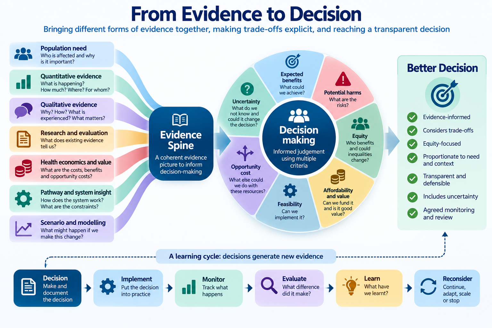

# Module 21: From Evidence to Decision

## Making transparent decisions when there are trade-offs and uncertainty

<button class="print-button" onclick="window.print()">🖨️ Print this module</button>

> **Given the evidence available, what should we actually do?**

## 1. Why Evidence Does Not Make the Decision

Throughout this series we have explored how healthcare decision-makers can make better use of:

- data
- statistical analysis
- evaluation
- health economics
- population health intelligence
- scenario modelling
- qualitative evidence
- research
- professional expertise
- lived experience.

But even excellent evidence does not automatically tell us what to do.

Imagine an intervention where the evidence suggests that it:

- improves patient outcomes
- is valued by patients
- could reduce pressure elsewhere in the system
- appears economically attractive.

There may still be difficult questions.

Can we afford it?

Do we have the workforce?

What would we have to stop doing to fund it?

Who would benefit?

Could some populations benefit more than others?

Could it widen inequalities?

How certain are we about the expected benefits?

Is there a better alternative?

These questions require **judgement**.

::: {.callout-important collapse="false"}
## Key Principle

**The purpose of Healthcare Decision Intelligence is not to remove judgement from healthcare decisions.**

It is to make that judgement:

- better informed
- more explicit
- more transparent
- more consistent
- more defensible.
:::

## Learning Objectives

By the end of this module, you should be able to:

- distinguish evidence generation from decision-making
- define the decision before considering solutions
- use an evidence spine to support a decision
- identify realistic alternative options
- make decision criteria explicit
- recognise and communicate trade-offs
- consider equity alongside effectiveness and value
- incorporate uncertainty into the decision
- understand the role of deliberation and judgement
- document the rationale for a decision
- specify what should be monitored and evaluated afterwards
- recognise when a decision should be reconsidered.

# 2. Start with the Decision

Before comparing interventions, models or business cases, define the decision.

A useful decision statement should clarify:

> **What are we deciding, for whom, from whose perspective, over what period, and why does the decision need to be made now?**

For example:

Instead of:

> *Should we invest in frailty services?*

Ask:

> **How should we configure proactive and urgent community support for people living with frailty over the next three years, given increasing need, current variation, available resources and uncertainty about impact?**

The second question creates a much clearer basis for analysis and deliberation.

::: {.callout-tip collapse="false"}
## Decision-Maker Questions

Before considering the evidence, ask:

- What exactly are we deciding?
- Who has authority to make the decision?
- Which population is affected?
- What problem are we trying to solve?
- What is the time horizon?
- What constraints already exist?
- What would happen if we did nothing?
:::

# 3. Bring Forward the Evidence Spine

Module 20 introduced the **evidence spine**.

The evidence spine connects the decision question with different forms of evidence:

> **Decision question**

↓

> **Population and need**

↓

> **Quantitative evidence**

+

> **Qualitative evidence**

+

> **Research and evaluation evidence**

↓

> **Triangulated interpretation**

↓

> **Evidence gaps and uncertainty**

The purpose of Module 21 is not to repeat this synthesis.

It is to ask:

> **Given that evidence picture, what should we do?**

The evidence spine therefore becomes the starting point for the decision.

# 4. Make the Decision Criteria Explicit

Healthcare decisions usually involve several criteria.

These might include:

| Criterion | Decision question |
|---|---|
| **Population need** | How significant is the need? |
| **Effectiveness** | Is the intervention likely to improve outcomes? |
| **Patient experience** | Does it improve what matters to patients and carers? |
| **Equity** | Who benefits and could inequalities change? |
| **Value** | Are the expected benefits worth the resources required? |
| **Affordability** | Can we fund it within available budgets? |
| **Workforce** | Do we have, or can we develop, the workforce required? |
| **Feasibility** | Can it realistically be implemented? |
| **Strategic fit** | Does it support wider system objectives? |
| **Uncertainty** | How confident are we about the expected consequences? |

Not every criterion will have equal importance for every decision.

The important thing is to make the criteria **visible before making the judgement**.

::: {.callout-important collapse="false"}
## Make the Criteria Visible

A decision becomes difficult to challenge constructively when the reasons for choosing an option remain implicit.

Making the criteria visible allows people to ask:

> **What mattered in this decision, and why?**
:::

# 5. Compare Realistic Options

Healthcare decisions should rarely be framed simply as:

> **Intervention versus do nothing.**

There may be several realistic alternatives.

For example:

- maintain the current service
- expand the service
- target the service differently
- redesign the pathway
- combine services
- reduce duplication
- phase implementation
- pilot and evaluate
- invest elsewhere
- disinvest.

The appropriate question is therefore:

> **Compared with what?**

This is important because opportunity cost exists even when it is not visible.

A £2 million investment decision is not simply:

> *Is this programme worth £2 million?*

It is:

> **Is this the best use of £2 million compared with the realistic alternatives available to us?**

# 6. Make the Trade-Offs Visible

Most difficult healthcare decisions are not choices between a clearly good option and a clearly bad one.

They involve trade-offs.

For example:

> **Better outcomes versus greater cost**

> **Broader access versus targeted investment**

> **Short-term affordability versus longer-term benefit**

> **Innovation versus certainty**

> **Efficiency versus resilience**

> **Benefit to one population versus benefit to another**

Consider an expansion of community frailty services.

Potential benefits might include:

- care closer to home
- improved patient and carer experience
- earlier intervention
- fewer avoidable escalations
- reduced pressure on acute services.

But expansion may also require:

- additional workforce
- additional community capacity
- investment before benefits emerge
- resources that could have been used elsewhere.

Some hospital capacity released may not translate into cash-releasing savings.

The decision therefore becomes:

> **Are the expected benefits sufficient to justify the resources, risks and opportunities forgone?**

::: {.callout-important collapse="false"}
## Trade-Offs Are Part of the Decision

A transparent decision does not pretend that every objective can be maximised simultaneously.

It makes clear:

> **What are we gaining, what are we giving up, and why do we consider that trade-off acceptable?**
:::

# 7. Consider Equity Explicitly

An intervention can improve average outcomes while increasing inequalities.

Decision-makers should therefore ask not only:

> *Does this intervention work?*

but:

> **For whom does it work, who might benefit most, and who might be left behind?**

For example, a digitally enabled service might improve access overall while creating additional barriers for people experiencing digital exclusion.

A targeted intervention might generate greater benefit in populations with higher need but reach fewer people overall.

Equity therefore needs to be considered alongside:

- effectiveness
- efficiency
- affordability
- feasibility.

Useful questions include:

- Which populations experience the greatest need?
- Who currently receives the service?
- Who does not?
- Who is most likely to benefit?
- Could the proposed option widen inequalities?
- Could targeting improve equity?
- Are some populations missing from the evidence?

::: {.callout-important collapse="false"}
## Average Improvement Is Not the Whole Story

**A decision can improve overall outcomes while leaving some populations behind.**

Always ask how benefits, harms and opportunities are distributed.
:::

# 8. Make Uncertainty Part of the Decision

Healthcare decisions are rarely made with complete information.

There may be uncertainty about:

- future demand
- intervention effectiveness
- uptake
- costs
- workforce
- implementation
- patient behaviour
- system interactions.

The objective is not to eliminate uncertainty before acting.

That may be impossible.

Instead ask:

> **Could reasonable uncertainty change the decision?**

For example:

If an intervention remains attractive whether its effect is 8%, 10% or 12%, uncertainty may not materially affect the decision.

If it is attractive only when assuming a 15% effect, but unattractive at 5%, then the decision may be highly sensitive to that assumption.

This connects directly with the scenario testing introduced in Module 19.

::: {.callout-tip collapse="false"}
## Decision-Maker Question

Do not ask only:

> *What is our best estimate?*

Also ask:

> **What would we decide if our key assumptions were wrong?**
:::

# 9. Judgement and Deliberation Still Matter

Not everything that matters can be reduced to a metric.

Healthcare decisions may involve:

- evidence
- patient values
- professional expertise
- ethical considerations
- organisational priorities
- affordability
- implementation realities
- political and public accountability.

This is why deliberation matters.

The purpose of deliberation is not to replace evidence with opinion.

It is to bring evidence and legitimate perspectives together so that the reasoning behind the decision becomes explicit.

A decision-making group might therefore include:

- patients or public representatives
- clinicians
- commissioners
- analysts
- finance
- health economists
- operational leaders
- relevant community or voluntary sector perspectives.

Different decisions will require different voices.

::: {.callout-important collapse="false"}
## Evidence Informs Judgement

**Evidence should constrain and inform judgement — not pretend to replace it.**

The objective is informed deliberation rather than decision-making by algorithm.
:::

# 10. Decision Quality Is Not the Same as Outcome Quality

Suppose two organisations make the same decision.

Organisation A:

- defines the decision clearly
- examines the available evidence
- considers alternatives
- makes assumptions explicit
- considers equity
- examines uncertainty
- documents the rationale.

Organisation B makes the same decision largely on intuition.

Both may ultimately experience the same outcome.

But the quality of their decision processes was not the same.

Conversely, a carefully considered decision can sometimes produce a poor outcome because the future is uncertain.

A poorly considered decision can occasionally produce a good outcome through luck.

::: {.callout-important collapse="false"}
## Decision Quality ≠ Outcome Quality

**A good decision does not guarantee a good outcome.**

And:

**A good outcome does not prove that the decision was well made.**

Decision quality should therefore be judged partly by the quality of the process used to reach it.
:::

This distinction matters because healthcare organisations need to learn from decisions without relying entirely on hindsight.

# 11. Worked Example: Should We Expand Community Frailty Support?

Consider an ICB deciding whether to expand proactive frailty and urgent community support.

The decision is:

> **How should the ICB configure community support for people living with frailty given increasing population need, variation in emergency admissions and limited resources?**

## The Evidence Spine

### Population Need

Population analysis shows:

- growth in older age groups
- increasing frailty
- increasing multimorbidity
- geographical variation in need.

### Quantitative Evidence

Analysis shows:

- high emergency admission rates among people with severe frailty
- substantial variation between localities
- variation in community service utilisation.

### Qualitative Evidence

Patients and carers describe:

- difficulty navigating services
- uncertainty about whom to contact during deterioration
- problems obtaining timely support
- poor continuity between services.

### Professional and Operational Evidence

Teams identify:

- variation in referral practices
- workforce constraints
- inconsistent community capacity
- differences in pathway availability.

### Evaluation Evidence

Available evidence suggests proactive and rapid community interventions may contribute to improved outcomes and reduced escalation for some patients.

However, precise attribution remains uncertain.

### Health Economics

Expansion requires additional investment.

Potential benefits include:

- improved outcomes
- improved patient experience
- hospital capacity released
- potentially avoided future costs.

Not all benefits represent cash-releasing savings.

### Scenario Modelling

Modelling suggests that shifting activity upstream is feasible only if sufficient community capacity is available.

Without that capacity, the bottleneck may simply move from hospital to community services.

## The Options

The ICB identifies four realistic options:

| Option | Potential benefit | Resource requirement | Equity | Feasibility | Uncertainty |
|---|---|---|---|---|---|
| **A. Maintain current model** | Limited | Low | Existing variation remains | High | Low |
| **B. Expand everywhere** | Potentially high | High | Broad reach | Workforce challenging | Moderate |
| **C. Target highest-need populations** | Potentially high | Moderate | Strong potential | More feasible | Moderate |
| **D. Phased targeted expansion with evaluation** | Moderate initially | Moderate | Can prioritise need | High | Generates further evidence |

No single analytical result automatically identifies the correct option.

The decision requires judgement.

## The Decision

After considering the evidence, resources, equity, feasibility and uncertainty, the ICB might decide:

> **Proceed with phased expansion targeted initially towards populations with the greatest need, accompanied by prospective evaluation and agreed review points.**

The important point is not whether this hypothetical decision is "correct".

It is that the rationale is visible.

Decision-makers can explain:

- what problem they were addressing
- what evidence they considered
- which alternatives were available
- which trade-offs they accepted
- what remained uncertain
- why the selected option was preferred.

That is a more defensible decision.

# 12. Document the Decision

Important decisions should leave an evidence trail.

A concise decision record might include:

| Question | Record |
|---|---|
| **What was decided?** | Selected option |
| **Why was the decision required?** | Problem and context |
| **What evidence was considered?** | Evidence spine |
| **What alternatives were considered?** | Realistic options |
| **What were the expected benefits?** | Outcomes and value |
| **What were the main trade-offs?** | Benefits forgone / disadvantages |
| **What equity issues were considered?** | Distribution of benefit and harm |
| **What assumptions were made?** | Key assumptions |
| **What remained uncertain?** | Evidence gaps |
| **Why was this option selected?** | Decision rationale |
| **What will be monitored?** | Measures and outcomes |
| **When will the decision be reviewed?** | Review point |

This does not need to become bureaucratic.

Its purpose is to make the decision **transparent and learnable**.

# 13. Decide What Would Make You Reconsider

A decision should not always be treated as permanent.

Before implementation, ask:

> **What evidence would cause us to reconsider this decision?**

For example:

- costs substantially exceed expectations
- uptake is lower than expected
- workforce cannot be recruited
- outcomes fail to improve
- inequalities increase
- unintended consequences emerge
- new evidence becomes available.

This creates a decision cycle:

> **Decide**

↓

> **Specify expected outcomes and assumptions**

↓

> **Implement**

↓

> **Monitor**

↓

> **Evaluate**

↓

> **Learn**

↓

> **Continue, adapt, scale, redesign or stop**

This turns decision-making into a learning process.

# 14. A Healthcare Decision Intelligence Framework

The whole process can now be brought together.

> **1. What decision are we making?**

↓

> **2. What does the evidence spine tell us?**

↓

> **3. What are the realistic options?**

↓

> **4. What are the expected benefits and harms?**

↓

> **5. Who benefits — and who might not?**

↓

> **6. What resources are required and what is forgone?**

↓

> **7. Is the option affordable and feasible?**

↓

> **8. What remains uncertain?**

↓

> **9. Could that uncertainty change the decision?**

↓

> **10. Make and document the judgement**

↓

> **11. Monitor and evaluate what happens**

↓

> **12. Revisit the decision when evidence or circumstances change**

::: {.callout-important collapse="false"}
## Healthcare Decision Intelligence

The purpose is not to produce a perfect decision.

It is to create a **better-informed, transparent and defensible decision process** using the best available evidence while recognising uncertainty, trade-offs and judgement.
:::

# 15. Decision-Maker Questions

Before making an important healthcare decision, ask:

1. **What exactly are we deciding?**
2. Who is affected?
3. What does our evidence spine tell us?
4. What are the realistic alternatives?
5. Have we considered maintaining the current position?
6. What benefits do we expect from each option?
7. What are the potential harms or unintended consequences?
8. Who benefits from each option?
9. Could inequalities improve or worsen?
10. What resources are required?
11. What opportunities are forgone?
12. Is the option affordable?
13. Is it operationally feasible?
14. What assumptions are we making?
15. What remains uncertain?
16. Could reasonable uncertainty change our preferred option?
17. What perspectives need to be part of the deliberation?
18. Can we explain why the preferred option was selected?
19. What will we monitor and evaluate?
20. **What evidence would cause us to reconsider the decision?**

# Bringing It All Together

Healthcare Decision Intelligence is not simply about producing better analysis.

It is about using evidence to make better decisions.

Across this series we have considered how to:

> **Understand the question**

↓

> **Understand the data**

↓

> **Understand variation and uncertainty**

↓

> **Understand pathways and systems**

↓

> **Evaluate what made a difference**

↓

> **Understand population need**

↓

> **Understand value and opportunity cost**

↓

> **Test possible changes before implementation**

↓

> **Bring quantitative and qualitative evidence together**

↓

> **Compare realistic options and trade-offs**

↓

> **Make a transparent judgement**

↓

> **Learn from what happens next**

The final step is not mathematical.

It is a judgement.

But it should be an **informed judgement**.

# Key Takeaways

- Evidence informs healthcare decisions but does not make them.
- Start by defining the decision rather than jumping immediately to a preferred solution.
- Bring forward the evidence spine developed in Module 20.
- Make decision criteria explicit.
- Compare realistic alternatives rather than simply intervention versus no intervention.
- Opportunity cost means asking what else could be achieved with the same resources.
- Difficult healthcare decisions involve trade-offs.
- Equity should be considered explicitly rather than assumed from average outcomes.
- Uncertainty should be incorporated into the decision rather than hidden.
- Ask whether reasonable changes in assumptions would alter the preferred option.
- Professional judgement and deliberation remain necessary.
- **Decision quality is not the same as outcome quality.**
- Document why a decision was made and what assumptions supported it.
- Specify what would cause the decision to be reconsidered.
- Decision-making should be treated as a learning cycle.
- The objective is not certainty or perfect decisions.
- **The objective is better-informed, more transparent and more defensible decisions for patients and populations.**

::: {.callout-important collapse="false"}
## The Final Question

The purpose of Healthcare Decision Intelligence is not to tell decision-makers what to decide.

It is to help them ask:

> **Given what we know, what we do not know, the choices available to us and the consequences of those choices — what is the most defensible decision we can make for the patients and populations we serve?**
:::
